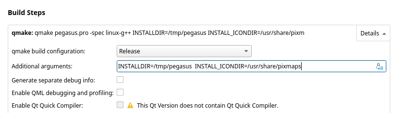

# Building Pegasus

Pegasus is a C++ program that uses the Qt framework. To build it for on your OS or device, you'll need a C++11 supporting compiler (eg. G++ 4.9, Visual Studio 2017), Qt 5.8 or later (version is important!) for your platform, and at least the following additional Qt components:

- QML module
- Qt Quick 2 module
- Multimedia module (might be called as MultimediaQuick)
- Svg module
- Gamepad module

Qt also provides a graphical IDE called Qt Creator, which you can use if you wish, but it's not a requirement. For installing Qt, see [this page](install-qt.md).

## Using Qt Creator

1. Open Qt Creator and open the project file (`pegasus.pro`)
2. Qt Creator will ask you which Qt setup ("kit") you want to use (in case you've installed multiple versions), and where you want to place the generated files (see Details). If everything's OK, click Configure Project.
3. (optional) Change the configuration (see [here](#configuration-options))
4. In the bottom left corner, on the sidebar of Qt Creator, you can find 4 buttons:

    - with the button that looks like a desktop monitor, you can change the build type (optimized Release build or development-friendly but slower Debug build)
    - the green arrow will build and run the program
    - the green arrow with a bug will also open several debug toolbars
    - the hammer will build the project but won't start the application

5. Change the build type to Release, and press the green arrow to build and run the project.

## Using the command line

1. Create a build directory somewhere, and `cd` into it
2. Call `qmake`, the configuration tool of Qt: `/path/to/qmake  path/to/project  [options]`.
    - If you have multiple Qt versions installed, make sure you call the right `qmake`. If you've installed using the official release from the Qt site, you can find it in `[qt-installdir]/Qt5/[version]/gcc_64/bin` (you can add it to your `$PATH` if you want, but it's not necessary).
    - You can also change some configuration options, which you can find [here](#configuration-options).
3. Call `make`
4. (optional) Call `make install`

## Configuration options

You can change build parameters to `qmake` (the Qt configuration tool) by appending `KEY=VALUE` pairs to its command line call. If you're using Qt Creator, you can find these settings on the Projects -> Build settings tab, where you can modify the Additional arguments option (see [here](https://doc.qt.io/qtcreator/creator-build-settings.html#build-steps)).

&nbsp;

The following additional parameters are available for QMake. Usually they don't need to be touched unless you wish to set up a certain installation structure (eg. on Linux).

Option | Description
---|---
`INSTALLDIR` | The general installation directory used by `make install`. Defaults to `/opt/pegasus-frontend` on Linux and `C:\pegasus-frontend` on Windows.
`INSTALL_BINDIR` | The installation directory of the  executable. You can use this to place the binary under `/usr/bin/`, for example. Defaults to `INSTALLDIR`.
`INSTALL_DATADIR` | The installation directory of the data files (if there's any), and where to look for them. You can use this to add another directory where Pegasus looks for themes, for example. Defaults to `INSTALLDIR`.
`INSTALL_DESKTOPDIR` | Linux only, if set, `make install` will create an XDG desktop file there (making Pegasus appear in the main menu). Unset by default, on most distros `/usr/share/applications` is a good value.
`INSTALL_ICONDIR` | Linux only, if set, `make install` will create an XDG icon file there (making Pegasus have an icon on the tray and the menu). Unset by default, on most distros `/usr/share/pixmaps` or `/usr/share/icons/hicolor/128x128/apps` is a good value.
