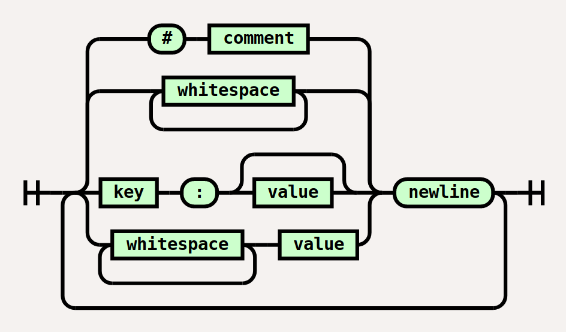

# Metadata file format

A metadata file is a human-readable text file based on the [Debian control file format](https://www.debian.org/doc/debian-policy/ch-controlfields.html). The preferred file name is `metadata.pegasus.txt`, the preferred encoding is UTF-8 and the preferred line ending sequence is the standard line feed character (U+000A, "`\n`").

The file contains a list of *entries*, where each entry has a *name* and one or more lines of *values*. For example the following file produces 3 entries: the first one has 1 value, the second has 2 and the third one has 3.

```make
name: single value

name:
  value line 1
  value line 2

name: value line 1
  value line 2
  value line 3
```

## Syntax

The metadata file is read line by line, and each line is expected to match one of the following four cases:

- If the line starts with `#`, the line is ignored
- If the line is empty or contains only whitespace characters, the line is ignored
- If the line starts with a non-whitespace character, it is expected to be in `name: value` format, which defines a new entry. The line is split at the very first `:` character found on the line, and any leading and trailing whitespace characters are ignored on both sides. The left side will be the name of the newly created entry: it must not be empty and must not contain the `:` character. The right side, if exists and not empty, will be the first value of the entry, otherwise the entry has no values at the moment.
- If the line starts with whitespace, value is added to the last defined entry after removing any leading or trailing whitespace. The cleaned value must not be empty.




<small>Note: `key` and `value` must not be empty after removing any leading and trailing whitespace characters</small>


## Text merging

After reading the file successfully, you will have a list of entries, each with a *name* and a list of values with at least one item in it. These entries can be used as-is to represent single values or list of values. However in case the values represent the lines of a flowing text, you might want to merge them together; if such text is expected to be a long text intended for display, this should be done with regards to the following rules:

- All lines should have no leading or trailing whitespace
- If a line consists of only a single dot `.` character, the line should be treated as a *paragraph break* (ie. an "empty line")
- The character sequence `\n` should be replaced with a single *line break*
- Lines should be joined with a single space between them, unless one of them already has a whitespace character (ie. line or paragraph break) at the point of connection
