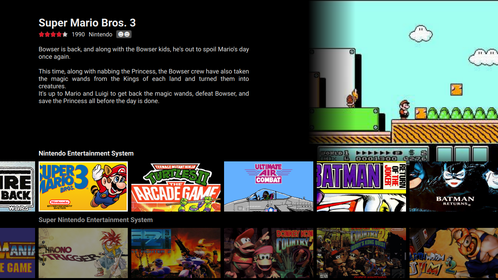
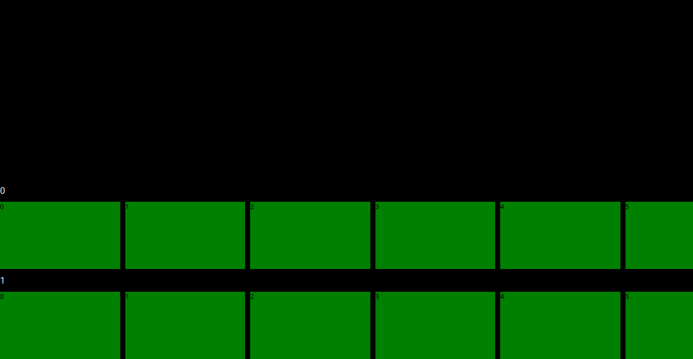

# Step-by-step: Flixnet theme

In this tutorial, we'll implement the theme above from scratch, inspired by the UI of a certain video streaming company. While the guide is intended to be beginner-friendly, this is a somewhat complex project, so you might want to be familiar with the QML basics and dynamic layout elements (see the [QML tutorials](qml-tutorials.md)).

If we simplify it a bit, here's how its structure and navigation looks like:

<video autoplay loop height="300"><source src="../webm/flixnet.webm" type="video/webm"></video>

As you can see, there are two main axes of motion:

- a horizontal **game axis** for each collection's games
- a vertical **collection axis** for selecting a collection

Each row can be individually scrolled, and the currently selected game is the topmost row's first (fully visible) item. Furthermore, the rows themselves can also be scrolled vertically. This kind of layout makes the theme a bit complex, but other than these axes the rest of the theme seems to be simple enough.

Let's get started!


## Initial files

I'm on Linux, so my [theme directory](overview.md) is at `~/.config/pegasus-frontend/themes`. I'm creating a new directory called `flixnet-tutorial`, and in it my `theme.cfg`, like this:

```control
name: Flixnet tutorial
author: Mátyás Mustoha
```

and the basic `theme.qml`:

```qml
import QtQuick 2.0

FocusScope {

}
```

Now I open Pegasus and select this theme on the Settings screen. I'll keep Pegasus open during the development, and refresh the theme with the ++f5++ key. I also open the main log file `~/.config/pegasus-frontend/lastrun.log` which will tell me if I've made any errors in the QML file.

!!! tip
    You can use whatever text editor you like. Qt Creator is cross platform, has good auto-complete and syntax highlight features. For a more lightweight editor, Sublime Text with the QML package, Atom or Notepad++ could be used, among others.

!!! note
    You might see `.qmlc` files popping up in your theme's directory. These are cache files, generated for faster loading. When copying the theme to a different machine, you don't have to bring them, they'll automatically get generated the next time you launch Pegasus.


## Initial layout

Let's start with the hard part, the layout on the bottom half. This is a vertically scrollable list of horizontally scrollable lists, each containing boxes for the games. Because collections are what contain the games, I'll first start making the vertical axis that selects the collection, and then add the horizontal game selection after that. I'll write a rough initial structure first, as once you have the basic layout done, you can tweak the elements as much as you want.

### Some planning

The game selection layout will take the whole lower half of the screen. On a standard 16:9 screen I want to show 2 rows of games to appear, and incrementally more on screens with smaller aspect ratios. Using Pegasus' virtual pixel values, I can design the theme for a screen with at least 720px height, and the values will scale appropriately for other resolutions. Based on that,

- if the height of the list is half the screen's height, I'll have 360px at least
- if I want to show two rows, one row's full height in the list will be 180px
- I'll use 18px font size for the collection's name
- to have some space around the text, I'll use 250% line height; that's 45px out of the 180px so far
- I'm left with 135px height to use for the game boxes
- the game boxes will have a 16:9 aspect ratio, so their width will be 240px

Ok, let's start coding!

### Vertical axis

A simple type for laying out a variable amount of items with one of them being selected is `ListView`. I set it up so it takes the whole lower half of the screen:

```qml
import QtQuick 2.0

FocusScope {

    ListView {
        id: collectionAxis

        anchors.left: parent.left
        anchors.right: parent.right
        anchors.top: parent.verticalCenter
        anchors.bottom: parent.bottom
    }

}
```

One element of this collection axis will have 180px height and the width is the whole width of the screen. I'll create a placeholder for now and add a fake `model` (a series of numbers) for testing (so you can see that they indeed come in order, and the ListView has the correct amount of items):

```qml hl_lines="13 14"
import QtQuick 2.0

FocusScope {

    ListView {
        id: collectionAxis

        anchors.left: parent.left
        anchors.right: parent.right
        anchors.top: parent.verticalCenter
        anchors.bottom: parent.bottom

        model: 10 // just some random number
        delegate: Rectangle {
            width: ListView.view.width
            height: vpx(180)

            color: "blue"
        }
    }

}
```

If you now refresh Pegasus, you'll see the lower half of the screen turned blue. Yay!

!!! help "vpx"
    The function `vpx` is what you can use for virtual pixel values. It scales up or down the pixel value you put into it depending on the actual screen resolution.

!!! help "delegate"
    The visual element of a list is called *delegate*. For every data item of the `model` (in this case, for every number between 0 and 9), a delegate will be created.

The code looks good so far, I'll just make a small change: the delegate will likely get more complex later, so to make it easier to read, I'll move it out into a separate `Component`:

```qml hl_lines="14 18"
import QtQuick 2.0

FocusScope {

    ListView {
        id: collectionAxis

        anchors.left: parent.left
        anchors.right: parent.right
        anchors.top: parent.verticalCenter
        anchors.bottom: parent.bottom

        model: 10
        delegate: collectionAxisDelegate
    }

    Component {
        id: collectionAxisDelegate

        Rectangle {
            width: ListView.view.width
            height: vpx(180)

            color: "blue"
        }
    }

}
```

!!! tip
    `Component` is a special element that defines a QML document. Actually, you could even move the `Rectangle` to a new file (eg. `CollectionAxisDelegate.qml`) and use the file's name to set the delegate (eg. `:::qml delegate: CollectionAxisDelegate { }`).

### Horizontal axis

The rows of the collection axis will consist of two things: a `Text` label that shows the collection's name and a `ListView` that shows its games. Because a `Component` can have only one child, I'll turn the `Rectangle` into an `Item` (an otherwise invisible container), and put a `Text` and a `ListView` into it.

!!! note
    Just as individual QML files can have only one root element, `Component` can have only one child.

First I'll add the collection label:

```qml hl_lines="14 18"
import QtQuick 2.0

FocusScope {

    ListView {
        id: collectionAxis

        // ...
    }

    Component {
        id: collectionAxisDelegate

        Item {
            width: ListView.view.width
            height: vpx(180)

            Text {
                id: label

                // `modelData` is the item in the list's model
                // for which this delegate is created for;
                // in this case a number between 0-9
                text: modelData

                // white, bold 18px font, using Pegasus' default font family
                color: "white"
                font.pixelSize: vpx(18)
                font.family: globalFonts.sans
                font.bold: true

                // make the line height 45px high
                // and center the text vertically in it
                height: vpx(45)
                verticalAlignment: Text.AlignVCenter
            }
        }
    }

}
```

If you refresh the theme in Pegasus, you'll now see the numbers "0" and "1" at where we'd expect the labels.

I'll now add the horizontal `ListView`:

```qml hl_lines="13"
Component {
    id: collectionAxisDelegate

    Item {
        width: ListView.view.width
        height: vpx(180)

        Text {
            id: label
            // ...
        }

        ListView {
            id: gameAxis

            // span from left to right, from the label's bottom to the row's bottom
            anchors.left: parent.left
            anchors.right: parent.right
            anchors.top: label.bottom
            anchors.bottom: parent.bottom

            // this one goes horizontal!
            orientation: ListView.Horizontal
        }
    }
}
```

We'll need a model and a delegate item to actually see something. Let's create some dummy items:

```qml hl_lines="22 23 24 30"
import QtQuick 2.0

FocusScope {
    // ...

    Component {
        id: collectionAxisDelegate

        Item {
            // ...

            ListView {
                id: gameAxis

                anchors.left: parent.left
                anchors.right: parent.right
                anchors.top: label.bottom
                anchors.bottom: parent.bottom

                orientation: ListView.Horizontal

                model: 20
                delegate: gameAxisDelegate
                spacing: vpx(10) // some spacing to make it look fancy
            }
        }
    }

    // this is one item of the horizontal axis, ie. a "game box"
    Component {
        id: gameAxisDelegate

        Rectangle {
            // as we calculated previously
            width: vpx(240)
            height: vpx(135)

            color: "green"

            Text {
                // will become a number between 0-19
                text: modelData
            }
        }
    }

}
```

And here's how it should look so far:



Not the most beautiful yet, however with this we're done with the basics of the main layout. From now on we'll just have tweak these lists and delegates, then add some simple components for the metadata.


## The code so far #1

Here's the whole code so far (without comments to save space):

??? note "The code so far #1"
        :::qml
        import QtQuick 2.0

        FocusScope {

            ListView {
                id: collectionAxis

                anchors.left: parent.left
                anchors.right: parent.right
                anchors.top: parent.verticalCenter
                anchors.bottom: parent.bottom

                model: 10
                delegate: collectionAxisDelegate
            }

            Component {
                id: collectionAxisDelegate

                Item {
                    width: ListView.view.width
                    height: vpx(180)

                    Text {
                        id: label

                        text: modelData
                        color: "white"
                        font.pixelSize: vpx(18)
                        font.family: globalFonts.sans

                        height: vpx(45)
                        verticalAlignment: Text.AlignVCenter
                    }

                    ListView {
                        id: gameAxis

                        anchors.left: parent.left
                        anchors.right: parent.right
                        anchors.top: label.bottom
                        anchors.bottom: parent.bottom

                        orientation: ListView.Horizontal

                        model: 20
                        delegate: gameAxisDelegate
                        spacing: vpx(10)
                    }
                }
            }

            Component {
                id: gameAxisDelegate

                Rectangle {
                    width: vpx(240)
                    height: vpx(135)

                    color: "green"

                    Text {
                        text: modelData
                    }
                }
            }

        }


## Navigation

You might have noticed that the components react already to mouse drag or scroll, but keyboard and gamepad input doesn't work yet. Let's fix this.

### Vertical scroll

Simply add `:::qml focus: true` to the collection axis:

```qml
ListView {
    id: collectionAxis

    // ...

    focus: true
}
```

You can now scroll the bars with ++up++ and ++down++, but... it's kind of weird right now. It'd be better for the items to "snap" to their place, to scroll to the next item when we press a button. This can be fixed with the `snapMode` and `highlightRangeMode` properties: setting `snapMode` keeps the elements organized when scrolling the list as a whole, while `highlightRangeMode` will make sure the selection follows the scrolling (that is, when you press ++up++ or ++down++, you actually select the next or previous element, not just view a different part of the list).

```qml
ListView {
    id: collectionAxis

    // ...

    snapMode: ListView.SnapOneItem
    highlightRangeMode: ListView.StrictlyEnforceRange

    focus: true
}
```

There, much better now.

!!! tip
    Setting up the keyboard input also makes gamepads work. Check the [Controls](../../user-guide/controls) page to see how are they related.

By default, every delegate that is at least partially in the ListView's area is fully drawn. To make sure only the rows in the lower half of the screen are visible, I set `clip` on the `ListView`:

```qml hl_lines="8"
ListView {
    id: collectionAxis

    // ...

    snapMode: ListView.SnapOneItem
    highlightRangeMode: ListView.StrictlyEnforceRange
    clip: true

    focus: true
}
```

### Horizontal scroll

We have a somewhat complex layout -- scrollable items inside a scrollable item; we can't just set `focus: true` here, since that'd mean we set it for *each* row, and end up with scrolling one we don't want. Hovewer, every `ListView` has select-next and select-previous function we can use (`incrementCurrentIndex()`, `decrementCurrentIndex()`), and the currently selected item can be accessed through `currentItem`.

In this case, the `currentItem` of `collectionAxis` will be the `Item` element inside `collectionAxisDelegate`:

```qml
Component {
    id: collectionAxisDelegate

    // this one!
    Item {
        width: ListView.view.width
        height: vpx(180)

        Text {
            id: label

            // ...
        }

        ListView {
            id: gameAxis

            // ...
        }
    }
}
```

But how can we access the ListView, `gameAxis` of the Item? Turns out we can't just use its `id`, as it's not accessible by external element (we'll get an error about `gameAxis` being undefined). Function definitions and `property` members, however, *can* be accessed. For now, I'll simply create an `alias` property for the horizontal axis:

```qml hl_lines="5"
Component {
    id: collectionAxisDelegate

    Item {
        property alias axis: gameAxis

        width: ListView.view.width
        height: vpx(180)

        Text {
            id: label

            // ...
        }

        ListView {
            id: gameAxis

            // ...
        }
    }
}
```

We can now access the game axis of the current collection as `currentItem.axis` (see below).

!!! note
    Yes, you can also write it like `property alias gameAxis: gameAxis`, I simply preferred the different name in this case.

Combining the ListView functions, `currentItem` and manual keyboard handling (`Keys`), we can now make the horizontal scrolling work with:

```qml hl_lines="7 8"
ListView {
    id: collectionAxis

    // ...

    focus: true
    Keys.onLeftPressed: currentItem.axis.decrementCurrentIndex()
    Keys.onRightPressed: currentItem.axis.incrementCurrentIndex()
}
```

...which, similarly to the vertical axis, initially scrolls in a not so nice way. Fix it like previously, but in the delegate:

```qml hl_lines="15 16"
ListView {
    id: gameAxis

    anchors.left: parent.left
    anchors.right: parent.right
    anchors.top: label.bottom
    anchors.bottom: parent.bottom

    orientation: ListView.Horizontal

    model: 100
    delegate: gameAxisDelegate
    spacing: vpx(10)

    snapMode: ListView.SnapOneItem
    highlightRangeMode: ListView.StrictlyEnforceRange
}
```

And now both directions should scroll finely!

!!! tip
    To see that the current item indeed changes, you could set the `color` of the `gameAxisDelegate`'s `Rectangle` to:

    `:::qml color: ListView.isCurrentItem ? "orange" : "green"`


## Left margin

There's a small margin on the left that shows the game before the currently selected one. We don't want to reduce the size of the horizontal `ListView`s (they should fill the whole width of the screen), we just want to move the currently selected item a little bit right. For this, we can use the `preferredHighlightBegin`/`End` members of the `ListView`s: they can be used to define a fixed position range (in pixels) where the currently selected element should reside.

I'll set a 100px offset like this:

```qml hl_lines="15 16"
ListView {
    id: gameAxis

    // ...

    preferredHighlightBegin: vpx(100)
    preferredHighlightEnd: preferredHighlightBegin + vpx(240) // the width of one game box
}
```

!!! help
    `preferredHighlightBegin` and `preferredHighlightEnd` almost always come in pair, and `End` must be greater or equal than `Begin` to have their effect applied.

We also need to move the collection label too. As it's just a regular Text element, I'll simply set its left anchor and a margin on it:

```qml hl_lines="12 13"
Component {
    id: collectionAxisDelegate

    Item {
        // ...

        Text {
            id: label

            // ...

            anchors.left: parent.left
            anchors.leftMargin: vpx(100)
        }

        ListView {
            id: gameAxis

            // ...
        }
    }
}
```

!!! note
    The anchor margin is only applied if the anchor itself is defined.

!!! tip
    You can also use the Text item's `leftPadding` property. This feature was added in Qt 5.6 (as mentioned in the [official documentation](https://doc-snapshots.qt.io/qt5-5.9/qml-qtquick-text.html#leftPadding-prop)), so you'll need to change the `import` command on the top of the QML file to `import QtQuick 2.6` or higher (Pegasus comes with Qt 5.9 at the moment).


## Using API data

Finally, the time has come to replace the placeholder elements with actual content. Let's start by using the real collection data. According to the [API reference](api.md), collections can be accessed and selected through `api.collections`: we can use `api.collections.model` as the `model` of a ListView (or any other View) and `index` as the `currentIndex` of it. We can then call `increaseIndex()` and `decreaseIndex()` to move to the next and previous items (or by setting the `index` manually).

### Vertical axis

First, find the ListView for the collection axis and set its `model` property. Then add the `currentIndex` line to bind it to the index from the API. Finally, call `increaseIndex()` and `decreaseIndex()` when ++up++ and ++down++ is pressed:

```qml hl_lines="6 7 13 14"
ListView {
    id: collectionAxis

    // ...

    model: api.collections.model
    currentIndex: api.collections.index
    delegate: collectionAxisDelegate

    // ...

    focus: true
    Keys.onUpPressed: api.collections.decrementIndex()
    Keys.onDownPressed: api.collections.incrementIndex()
    Keys.onLeftPressed: currentItem.axis.decrementCurrentIndex()
    Keys.onRightPressed: currentItem.axis.incrementCurrentIndex()
}
```

!!! warning
    Incrementing/decrementing the `currentIndex` property of a ListView (eg. by navigation) has no effect on the bound value (in this case `api.collections.index`); this is why I call `incrementIndex()`/`decrementIndex()` manually on ++up++ and ++down++. We'll also modify the ++left++/++right++ keys very soon.

!!! tip
    Instead of using `Keys` and increment/decrement, you can also set `api.collections.index` manually, eg.

    `:::qml onCurrentIndexChanged: api.collections.index = currentIndex`

!!! help
    `incrementIndex()` and `decrementIndex()` wraps around (incrementing the index at the last item will make it jump to the first one). If you don't want them to wrap, you can use `incrementIndexNoWrap()` and `decrementIndexNoWrap()` instead.

Previously the `model` was set to `10`, and so the `modelData` available in the delegates was a number between 0 and 9. With `model` set to `api.collections.model`, the `modelData` will be a `Collection` object.

A `Collection` always has a `tag` (a short, unique label) and possibly a proper `name`. We should show the `name` if it's available, and fall back to the `tag` if it's not defined. We can do it like this:

```qml hl_lines="10"
Component {
    id: collectionAxisDelegate

    Item {
        // ...

        Text {
            id: label

            text: modelData.name || modelData.tag
            color: "white"
            font.pixelSize: vpx(18)
            font.family: globalFonts.sans

            // ...
        }

        ListView {
            id: gameAxis

            // ...
        }
    }
}
```

!!! tip
    If the name of the `modelData` property you use (in this case `name` and `tag`) don't collide with other properties of the object, it's not required to type out `modelData`: you can simply write `text: name || tag`.

After a refresh, you should see the names of collections appearing in Pegasus.


### Horizontal axis

Now let's show the game titles in the horizontal rectangles. Every `Collection` has a `games` member we can use to access the list of games associated with the collection. Similarly to `collections`, `games` also has `model` and `index` properties, so let's use them in the horizontal axis (`collectionAxisDelegate`):

```qml hl_lines="18 19"
Component {
    id: collectionAxisDelegate

    Item {
        // ...

        Text {
            id: label

            // ...
        }

        ListView {
            id: gameAxis

            // ...

            model: modelData.games.model
            currentIndex: modelData.games.index
            delegate: gameAxisDelegate
            spacing: vpx(10)

            // ...
        }
    }
}
```

Just like with the vertical axis, I'll use `incrementIndex()` and `decrementIndex()` again. Currently we access the horizontal ListView of the collection delegate via an `alias` property, and call the ListView's `incrementCurrentIndex()` and `decrementCurrentIndex()` methods by `Keys.onLeftPressed` and `Keys.onRightPressed` of the collection axis. Instead, we should call the index changing functions of the API, of the Collection belonging to a delegate (ie. `modelData`).

As usual, there are more than one way to do it, I'll show how you can use JavaScript functions this time. First, find the `property alias axis: gameAxis` line

```qml hl_lines="5"
Component {
    id: collectionAxisDelegate

    Item {
        property alias axis: gameAxis // this one

        // ...

        Text { ... }
        ListView { ... }
    }
}
```

then delete and replace it with the `selectNext()` and `selectPrev()` functions, with the increment/decrement methods of the API in their body:

```qml
Component {
    id: collectionAxisDelegate

    Item {
        function selectNext() {
            modelData.games.incrementIndex();
        }

        function selectPrev() {
            modelData.games.decrementIndex();
        }


        // ...

        Text { ... }
        ListView { ... }
    }
}
```

Then you can call the new functions in the `collectionAxis` like this:

```qml hl_lines="15 16"
ListView {
    id: collectionAxis

    // ...

    model: api.collections.model
    currentIndex: api.collections.index
    delegate: collectionAxisDelegate

    // ...

    focus: true
    Keys.onUpPressed: api.collections.decrementIndex()
    Keys.onDownPressed: api.collections.incrementIndex()
    Keys.onLeftPressed: currentItem.selectPrev()
    Keys.onRightPressed: currentItem.selectNext()
}
```

And now the Views scroll properly, with the real data!

### Game items

With the previous changes, `gameAxisDelegate` is now a visual representation for a Game element. A Game always has a `title`, so we can simply set it as the text:

```qml hl_lines="11"
Component {
    id: gameAxisDelegate

    Rectangle {
        width: vpx(240)
        height: vpx(135)

        color: "green"

        Text {
            text: modelData.title
        }
    }
}
```

!!! help
    The `model` of the *vertical* ListView was a list of `Collection`s, so the `modelData` received by a delegate of that ListView (one whole horizontal row) is one `Collection` object.

    The `model` of these *horizontal* ListViews is a list of `Game`s, so a delegate of the horizontal ListViews will see a `Game` in its `modelData`.

And now the game names also show up in Pegasus:


### Launching games

Now that the game selection items are in sync with the API, we can actually launch games! To start the currently selected game, simply call `api.currentGame.launch()` when ++return++ is pressed:

```qml hl_lines="11"
ListView {
    id: collectionAxis

    // ...

    focus: true
    Keys.onUpPressed: api.collections.decrementIndex()
    Keys.onDownPressed: api.collections.incrementIndex()
    Keys.onLeftPressed: currentItem.selectPrev()
    Keys.onRightPressed: currentItem.selectNext()
    Keys.onReturnPressed: api.currentGame.launch()
}
```

!!! help
    Careful not to confuse the `onReturnPressed` and `onEnterPressed` calls: technically `Return` is the key next to the letters, while `Enter` is the one on the numeric keypad.

!!! note
    `onReturnPressed` is also triggered by pressing / on the gamepad.

And with this, technically our theme is fully functional!

Next step, let's make it pretty.

## The code so far #2

??? note "The code so far #2"
        :::qml
        import QtQuick 2.0

        FocusScope {

            ListView {
                id: collectionAxis

                anchors.left: parent.left
                anchors.right: parent.right
                anchors.top: parent.verticalCenter
                anchors.bottom: parent.bottom

                model: api.collections.model
                currentIndex: api.collections.index
                delegate: collectionAxisDelegate

                snapMode: ListView.SnapOneItem
                highlightRangeMode: ListView.StrictlyEnforceRange
                clip: true

                focus: true
                Keys.onUpPressed: api.collections.decrementIndex()
                Keys.onDownPressed: api.collections.incrementIndex()
                Keys.onLeftPressed: currentItem.selectPrev()
                Keys.onRightPressed: currentItem.selectNext()
                Keys.onReturnPressed: api.currentGame.launch()
            }

            Component {
                id: collectionAxisDelegate

                Item {
                    function selectNext() {
                        modelData.games.incrementIndex();
                    }

                    function selectPrev() {
                        modelData.games.decrementIndex();
                    }

                    width: ListView.view.width
                    height: vpx(180)

                    Text {
                        id: label

                        text: modelData.name || modelData.tag
                        color: "white"
                        font.pixelSize: vpx(18)
                        font.family: globalFonts.sans

                        height: vpx(45)
                        verticalAlignment: Text.AlignVCenter

                        anchors.left: parent.left
                        anchors.leftMargin: vpx(100)
                    }

                    ListView {
                        id: gameAxis

                        anchors.left: parent.left
                        anchors.right: parent.right
                        anchors.top: label.bottom
                        anchors.bottom: parent.bottom

                        orientation: ListView.Horizontal

                        model: modelData.games.model
                        currentIndex: modelData.games.index
                        delegate: gameAxisDelegate
                        spacing: vpx(10)

                        snapMode: ListView.SnapOneItem
                        highlightRangeMode: ListView.StrictlyEnforceRange

                        preferredHighlightBegin: vpx(100)
                        preferredHighlightEnd: preferredHighlightBegin + vpx(240)
                    }
                }
            }

            Component {
                id: gameAxisDelegate

                Rectangle {
                    width: vpx(240)
                    height: vpx(135)

                    color: "green"

                    Text {
                        text: modelData.title
                    }
                }
            }

        }


## Fancy game boxes

I'll now replace the green game boxes with something better to look at. There are two main cases we have to support:

- if there is an available image for a game, the box should show that
- if there is none, or the image has not loaded yet, the box should show a gray rectangle, with the game's title in the center

So `gameAxisDelegate` is our game box that right now contains a green rectangle. I'll turn that into an Item, and, for the two cases above, I'll add an initial gray Rectangle and Image:

```qml
Component {
    id: gameAxisDelegate

    Item {
        width: vpx(240)
        height: vpx(135)

        Rectangle {
            anchors.fill: parent
            color: "#333"
        }

        Image {
            id: image

            anchors.fill: parent
        }
    }
}
```

So which image asset should we use? A game box is a rectangle with 16:9 aspect ratio, so the `banner` would be perfect for this. However, since every asset is potentially missing, we should consider showing other images and provide multiple fallbacks. If we don't have a `banner`, the next similarly sized one is the `steam` ("grid icon") asset. Because it's wider than 16:9, we'll need to crop it if we don't want black bars or squashed/scretched images (though you might prefer that). If neither image is available, I'll use `boxFront` as it tends to be commonly available.

Let's extend the Image object created previously:

```qml
Image {
    id: image

    anchors.fill: parent
    visible: source

    // fill the whole area, cropping what lies outside
    fillMode: Image.PreserveAspectCrop

    asynchronous: true
    source: assets.banner || assets.steam || assets.boxFront
    sourceSize { width: 256; height: 256 }
}
```

I've also made some optimizations here:

- I've set `asynchronous: true`: Loading image files takes some time depending on the device Pegasus runs on. If this property is set to false (default), the program will not react to input until the image is loaded (or noticed that it failed to load). If it's false, the image is loaded "in the background", and input is not blocked; hovewer depending on your theme, you might want to show something in its place for the users during this time (eg. a loading spinner or progress bar).
- I've set `sourceSize`: This sets the maximum size the image should occupy in the memory. The [official documentation](https://doc-snapshots.qt.io/qt5-dev/qml-qtquick-image.html#sourceSize-prop) describes this in detail.
- I've set `visible: source`, that is, if the `source` is empty (neither `banner`, `steam` or `boxFront` is available), then ignore this whole object: no input will be ever handled here and there's nothing to see either.

With these changes, here's how it looks:


Starting to take shape, isn't it?

Let's finish the text-only fallback too:

```qml hl_lines="11 13"
Component {
    id: gameAxisDelegate

    Item {
        width: vpx(240)
        height: vpx(135)

        Rectangle {
            anchors.fill: parent
            color: "#333"
            visible: image.status !== Image.Ready

            Text {
                text: modelData.title

                // define the text area
                anchors.fill: parent
                anchors.margins: vpx(12)

                // align to the center
                horizontalAlignment: Text.AlignHCenter
                verticalAlignment: Text.AlignVCenter
                wrapMode: Text.Wrap

                // set the font
                color: "white"
                font.pixelSize: vpx(16)
                font.family: globalFonts.sans
            }
        }

        Image {
            id: image

            // ...
        }
    }
}
```

And we're done with the game boxes!


## Looping the axes

It'd be nice if all of the lists would loop around. You can do two kinds of loop:

- make the list finite and when the last item is reached, jump back to the first one (and also in reverse direction)
- make the list infinite and loop around (carousel style)

The first one can be done either by simply setting `keyNavigationWraps: true` for a ListView (and other Views) or using the API's default index increase/decrease functions. In our case though, the carousel option would look the best.

I won't lie, making a carousel-like looping list is annoying and overly complex for this use case; the situation might improve later by creating some easier-to-use custom types in Pegasus.

### Vertically

So the problem is, ListView can't do carousels: the only type that can is PathView. As such, we'll turn our ListViews into PathViews next. Again, let's start with the vertical axis; here's a before-after comparison, with some comments after the code:

**Before**

```qml
ListView {
    id: collectionAxis

    anchors.left: parent.left
    anchors.right: parent.right
    anchors.top: parent.verticalCenter
    anchors.bottom: parent.bottom

    model: api.collections.model
    currentIndex: api.collections.index
    delegate: collectionAxisDelegate

    snapMode: ListView.SnapOneItem
    highlightRangeMode: ListView.StrictlyEnforceRange
    clip: true

    focus: true
    Keys.onUpPressed: api.collections.decrementIndex()
    Keys.onDownPressed: api.collections.incrementIndex()
    Keys.onLeftPressed: currentItem.selectPrev()
    Keys.onRightPressed: currentItem.selectNext()
    Keys.onReturnPressed: api.currentGame.launch()
}
```

**After**

```qml hl_lines="14 19"
PathView {
    id: collectionAxis

    anchors.left: parent.left
    anchors.right: parent.right
    anchors.top: parent.verticalCenter
    anchors.bottom: parent.bottom

    model: api.collections.model
    currentIndex: api.collections.index
    delegate: collectionAxisDelegate


    // changed ListView to PathView
    snapMode: PathView.SnapOneItem
    highlightRangeMode: PathView.StrictlyEnforceRange
    clip: true

    // brand new: path definitions
    pathItemCount: 1 + Math.ceil(height / vpx(180))
    path: Path {
        startX: collectionAxis.width * 0.5
        startY: vpx(180) * -0.5
        PathLine {
            x: collectionAxis.path.startX
            y: collectionAxis.path.startY + collectionAxis.pathItemCount * vpx(180)
        }
    }
    preferredHighlightBegin: 1 / pathItemCount
    preferredHighlightEnd: preferredHighlightBegin


    focus: true
    Keys.onUpPressed: api.collections.decrementIndex()
    Keys.onDownPressed: api.collections.incrementIndex()
    Keys.onLeftPressed: currentItem.selectPrev()
    Keys.onRightPressed: currentItem.selectNext()
    Keys.onReturnPressed: api.currentGame.launch()
}
```

!!! warning
    Don't forget to change ListView to PathView in the delegate (`collectionAxisDelegate`'s `width` prop) too!

Unlike ListView that goes to one direction only, PathView can be used to create arbitrary paths on which the items will travel (curves, circles, all kinds of shapes). Because of that, some properties have to be provided in percentage or need manual calculations.

- For PathViews, `pathItemCount` must be set (the default behaviour is to show all items). We should show as many rows as it fits into lower half or the screen (one row's height is 180px). The number of visible items thus will be [area height] / [row height], which I've rounded up using `Math.ceil`, a standard JavaScript function. However, when there's a scrolling going on, there'll be actually **one more** row visible on the screen: the topmost row will gradually go *out* on the top of the lower area, while a new line is on its way *in* to appear on the bottom (see the animation below).

- The `path` defines the trail the elements will follow **by their center point**. Because there'll be one item that slides *out*, and one that slides *in*, the path extends above and below the PathView's area. The starting point of the axis (the center point of the item that will slide out) is horizontally (`startX`) the center of the screen (as the rows fill the width), and vertically (`startY`) above the top edge of the PathView (which would be 0) by 50% of the row height (where values are in pixels). From the start point, a linear path is created with `PathLine`: I've set it so the end point is the same as the start except the `Y` coordinate, which is increased by the length ot the path, [number of max. visible items] * [item height].

- The preferred highlight positions are in **percentage** for the PathView (as it can have any kind of shape, pixels don't always make sense). Again, the values define the range for the *center point* of the selected item. It defaults to 0 (start of the line), which in our case would be the center of the sliding out element, out of the visible area. I've set it to [1] / [item count], which will produce the center point of the *second* element on the path. Since I'm not planning to add any additional effects and such, just select one item, I've set the end of the range to the same as the beginning.

<video autoplay loop style="max-width:100%;display:block;margin:0 auto"><source src="../webm/flixnet_pathview.webm" type="video/webm"></video>

*Structure of the vertical PathView. The red line marks the path, with red dots at positions 0/4 (top), 1/4, 2/4, 3/4 and 4/4 (bottom). The centers of the delegates are marked with blue.*

### Horizontally

The horizontal scrolling works similarly, with one important difference: there is a margin on the left of the currently selected item, where the previous one is halfway in the screen. We'll have to shift the whole path horizontally, and add 1 to the maximum number of visible items, and another one to account for scrolling, just like at the vertical axis.

<video autoplay loop style="max-width:100%;display:block;margin:0 auto"><source src="../webm/flixnet_pathview2.webm" type="video/webm"></video>

I've set the left margin previously to 100 px and the width of a game box to be 240x135. In addition, there's a 10px spacing between the elements, giving the full width of a box to 250. The center of the current-item would be at 100 + 250/2 = 225 on the path, but to make it align with the collection label, I'll shift it 5px (half of the spacing) to the left, making the X center to be 220px. Then counting backwards, the previous-item will be at 220 - 250, and the one before that (the leftmost postion, where the new elements will appear when scrolling) at 220 - 250 * 2.

All right, let's change the horizontal ListView into a PathView:

**Before**:

```qml
ListView {
    id: gameAxis

    anchors.left: parent.left
    anchors.right: parent.right
    anchors.top: label.bottom
    anchors.bottom: parent.bottom

    orientation: ListView.Horizontal

    model: modelData.games.model
    currentIndex: modelData.games.index
    delegate: gameAxisDelegate
    spacing: vpx(10)

    snapMode: ListView.SnapOneItem
    highlightRangeMode: ListView.StrictlyEnforceRange

    preferredHighlightBegin: vpx(100)
    preferredHighlightEnd: preferredHighlightBegin + vpx(240)
}
```

**After**:

```qml hl_lines="9 11 16 21 31"
PathView {
    id: gameAxis

    anchors.left: parent.left
    anchors.right: parent.right
    anchors.top: label.bottom
    anchors.bottom: parent.bottom

    // removed orientation

    // removed spacing
    model: modelData.games.model
    currentIndex: modelData.games.index
    delegate: gameAxisDelegate

    // changed ListView to PathView
    snapMode: PathView.SnapOneItem
    highlightRangeMode: PathView.StrictlyEnforceRange


    // brand new: path definitions
    pathItemCount: 2 + Math.ceil(width / vpx(250)) // note the '2'!
    path: Path {
        startX: vpx(220) - vpx(250) * 2
        startY: vpx(135) * 0.5
        PathLine {
            x: gameAxis.path.startX + gameAxis.pathItemCount * vpx(250)
            y: gameAxis.path.startY
        }
    }
    // changed highlight range
    preferredHighlightBegin: 2 / pathItemCount
    preferredHighlightEnd: preferredHighlightBegin
}
```

And now both the horizontal and vertical axis loops as intended!

!!! tip
    Typing out fixed values in pixels every time can be tedious and error prone. I'd recommend defining them as properties at the top of the object they're used in (eg. `property real boxHeight: vpx(135)`).


## The rest of the theme

The upper half of the screen contains the metadata and preview image of the currently selected game. The components here will consist of simple elements, like Image and Text, which will make adding them way easier.

You can place all these elements directly under the main `FocusScope`, or you could create a containing Item if you wish. I'll do the former to keep the guide shorter.

As for accessing the actual game data, we can use the properties of `api.currentGame` for metadata information, and `api.currentGame.assets` for the assets. You can find all the available fields listed in the [API reference](api.md).

### Title

A simple Text item in the upper left corner, with the left margin set to the same 100px we used at the game rows, and some additional margin at the top.

```qml
Text {
    id: title

    text: api.currentGame.title
    color: "white"

    font.pixelSize: vpx(32)
    font.family: globalFonts.sans
    font.bold: true

    anchors.top: parent.top
    anchors.topMargin: vpx(42)
    anchors.left: parent.left
    anchors.leftMargin: vpx(100)
}
```

### Rating

The rating will be displayed as a five-star bar, with some percentage of it colored according to the actual rating. This can be done with two simple, overlapping QML Images: draw five empty stars first, then over them, draw filled ones according to the rating. Kind of like a progress bar, except we're using stars for filling.

But first of all, I actuatlly draw two images for the stars, an empty one and a filled. Both have square size and transparent background. I create a new directory (eg. `assets`) in my theme folder and put them there.

star_empty.svg | star_filled.svg
:---: | :----:
 | 

!!! tip
    I've used Inkscape for drawing the vector art; it has a built-in tool for drawing stars and other polygons.

Then I create the following Item. As the star image is a square, I make its width 5 times the height to hold the five stars horizontally. I make the empty-star Image fill this whole item, and set `fillMode: Image.TileHorizontally` to make the star repeat horizontally. For the filled-star image, I place it over the other one, and modify its width by the rating, which is provided as a number between `0.0` and `1.0` (0% and 100%).

```qml
Item {
    id: rating

    // set the item's dimensions
    height: vpx(16)
    width: height * 5

    // put it under the title
    anchors.top: title.bottom
    anchors.left: title.left


    // the empty stars
    Image {
        anchors.fill: parent

        source: "assets/star_empty.svg"
        sourceSize { width: parent.height; height: parent.height }

        // the most important bits!
        fillMode: Image.TileHorizontally
        horizontalAlignment: Image.AlignLeft
    }


    // the filled stars
    Image {
        anchors.top: parent.top
        anchors.left: parent.left

        width: parent.width * api.currentGame.rating // !!!
        height: parent.height

        source: "assets/star_filled.svg"
        sourceSize { width: parent.height; height: parent.height }

        fillMode: Image.TileHorizontally
        horizontalAlignment: Image.AlignLeft
    }

}
```

!!! note
    Without `horizontalAlignment` the stars might not line up perfectly (the repeat will start from the center).

When a game has no rating defined, `game.rating` is `0.0`. Showing five empty stars for an otherwise good game might be a bit misleading, so I'll make the rating bar only appear when the `rating` is over 0%:

```qml hl_lines="4"
Item {
    id: rating

    visible: api.currentGame.rating > 0.0

    // ...
}
```

### Release year

Yet another simple Text element:

```qml
Text {
    id: year

    // if not defined, the release year is 0
    visible: game.year > 0

    text: game.year
    color: "white"
    font.pixelSize: vpx(16)
    font.family: globalFonts.sans

    anchors.left: rating.right
    anchors.top: rating.top
}
```

#### Row

Currently the `year` element is manually anchored right next to the rating. Doing this for each item every time is quite annoying, let's just put them in a `Row`:

```qml
Row {
    id: detailsRow

    // anchor the whole row
    anchors.top: title.bottom
    anchors.topMargin: vpx(5)
    anchors.left: title.left

    spacing: vpx(10)


    Item {
        id: rating

        // remove anchor items!
        // anchors.top: title.bottom
        // anchors.left: title.left

        // ...
    }

    Text {
        id: year

        // remove anchor items!
        // anchors.left: rating.right
        // anchors.top: rating.top

        // ...
    }
}
```

### Player count

This one will be a rounded rectangle with smiley faces in it indicating the number of players. The player count defaults to one; similarly to the rating, I'll show the component only if the player count is more than one.

First I create the smiley face image (based on the Unicode "filled smiling face" symbol ([U+263B](https://www.fileformat.info/info/unicode/char/263b/index.htm)). Again, it's square sized with a transparent background.

<div style="background-color: #555;padding:10px 0;text-align:center">

</div>

Then create a background rounded Rectangle and the smiles Image in it, putting the whole thing in the Row created in the previous step:

```qml
Rectangle {
    id: multiplayer

    // the Rectangle's size depends on the Image,
    // with some additional padding
    width: smileys.width + vpx(8)
    height: smileys.height + vpx(5)

    color: "#555"
    radius: vpx(3)

    visible: api.currentGame.players > 1


    Image {
        id: smileys

        // 13px looked good for me
        width: vpx(13) * api.currentGame.players
        height: vpx(13)

        anchors.centerIn: parent

        source: "assets/smiley.svg"
        sourceSize { width: smileys.height; height: smileys.height }

        fillMode: Image.TileHorizontally
        horizontalAlignment: Image.AlignLeft
    }
}
```

### Developer

Yet another simple Text in the Row:

```qml
Text {
    id: developer

    text: api.currentGame.developer
    color: "white"
    font.pixelSize: vpx(16)
    font.family: globalFonts.sans
}
```

!!! tip
    A game may have multiple developers: if you just want to show them as a Text, you can use `<Game>.developer`, a string that simply lists them all. There's also `<Game>.developerList`, a JavaScript `Array`, if you wish to use them individually.

### Description

A bigger text with set boundaries for alignment. If there is a short `summary`, I'll use that, otherwise the beginning of the full description.

```qml
Text {
    id: description

    text: api.currentGame.description
    color: "white"
    font.pixelSize: vpx(18)
    font.family: globalFonts.sans

    // allow word wrapping, justify horizontally
    wrapMode: Text.WordWrap
    horizontalAlignment: Text.AlignJustify
    // if the text is too long, end it with an ellipsis (...)
    elide: Text.ElideRight

    anchors {
        left: detailsRow.left
        right: parent.horizontalCenter
        top: detailsRow.bottom; topMargin: vpx(20)
        bottom: parent.verticalCenter; bottomMargin: vpx(32)
    }
}
```

### Screenshot

This should be below everything else on the screen -- in fact, if you look at the image at the beginning of this guide, it's actually going into the bottom-half region of the screen, reaching the row of images.

As it's under everything else, I'll put its implementation at the top of the theme file, even before the collections' PathView. I'll anchor the top and left edges of the image to the top right corner of the screen. To make it go slightly into the bottom half, I'll anchor the bottom edge to the vertical center of the screen, then add a small amount of **negative margin** to the bottom (a positive margin *reduces* the size of the element, while a negative one *increases* it).

```qml
Image {
    id: screenshot

    asynchronous: true
    fillMode: Image.PreserveAspectFit

    // set the first screenshot as source, or nothing
    source: api.currentGame.assets.screenshots[0] || ""
    sourceSize { width: 512; height: 512 }

    anchors.top: parent.top
    anchors.right: parent.right
    anchors.bottom: parent.verticalCenter
    anchors.bottomMargin: vpx(-45) // the height of the collection label
}
```

!!! note
    Using negative margins kind of feels like a hack though, so depending on the situation you might prefer to use simple width/height properties.

!!! help
    The screenshots are stored under `assets.screenshots`, which is a regular JavaScript `Array`. If it's empty, `screenshots[0]` will be `undefined`, and setting an `undefined` value as the `source` of an Image will produce a warning in the log. Setting it to an empty string, however, will not, so appending `|| ""` as a fallback will silence the warning.

    An alternative solution could be is to use `screenshots` as a `model` in eg. a ListView, and the Image as delegate. You could then further extend it to periodically change the current visible screenshot.

!!! tip
    You can also use the `z` property of the components to set their relative "height".

#### Gradients

There are two linear gradients ("fade-ins"), one from the left and one from the bottom of the image. Such effect can be added just like regular components, can be positioned, sized, animated, etc. But first of all, to use gradients you'll need the `QtGraphicalEffects` QML module:

```qml hl_lines="2"
import QtQuick 2.0
import QtGraphicalEffects 1.0

FocusScope {
    // ...
}
```

Then, create the horizontal linear gradient inside our Image component:

```qml
Image {
    id: screenshot

    // ...


    LinearGradient {
        width: parent.width * 0.25
        height: parent.height

        anchors.left: parent.left

        // since it goes straight horizontally from the left,
        // the Y of the point doesn't really matter
        start: Qt.point(0, 0)
        end: Qt.point(width, 0)
        // at the left side (0%), it starts with a fully visible black
        // at the right side (100%), it blends into transparency
        gradient: Gradient {
            GradientStop { position: 0.0; color: "black" }
            GradientStop { position: 1.0; color: "transparent" }
        }
    }

}
```

And another for the bottom:

```qml
LinearGradient {
    width: parent.width
    height: vpx(50)

    anchors.bottom: parent.bottom

    // goes straight up, so the X of the point doesn't really matter
    start: Qt.point(0, height)
    end: Qt.point(0, 0)
    gradient: Gradient {
        GradientStop { position: 0.0; color: "black" }
        GradientStop { position: 1.0; color: "transparent" }
    }
}
```

And we're done!

### Selection marker

Perhaps not easy to notice on the example images, but actually there's a white rectangular border around the current item's place on the topmost horizontal axis. It's position is fixed and does not move even during scrolling.

I'll create an empty, border-only Rectangle for it. Since it's over everything else in the theme, I'll put it to the bottom of the whole file, after the `gameAxisDelegate`'s definition.

```qml
Rectangle {
    id: selectionMarker

    width: vpx(240)
    height: vpx(135)

    color: "transparent"
    border { width: 3; color: "white" }

    anchors.left: parent.left
    anchors.leftMargin: vpx(100)
    anchors.top: parent.verticalCenter
    anchors.topMargin: vpx(45)
}
```


### Opacity

The currently active horizontal row is fully visible, while the rest are a bit darker. I'll set the opacity of the non-active rows to 60%. In addition, I'll add a light animation, so instead of a sudden change in the visibility, the rows gradually raise their opacity during scrolling.

Simply add these two lines to the `collectionAxisDelegate`:

```qml hl_lines="9 10"
Component {
    id: collectionAxisDelegate

    Item {
        // JS functions

        // width, height

        opacity: PathView.isCurrentItem ? 1.0 : 0.6
        Behavior on opacity { NumberAnimation { duration: 150 } }

        // ...
    }
}
```


## Done!

With all these components added, it seems we're actually done! Here's the end result:


And the full code:

??? note "The code so far #3"
        :::qml
        import QtQuick 2.0
        import QtGraphicalEffects 1.0


        FocusScope {

            Image {
                id: screenshot

                asynchronous: true
                fillMode: Image.PreserveAspectFit

                source: api.currentGame.assets.screenshots[0] || ""
                sourceSize { width: 512; height: 512 }

                anchors.top: parent.top
                anchors.right: parent.right
                anchors.bottom: parent.verticalCenter
                anchors.bottomMargin: vpx(-45)

                LinearGradient {
                    width: parent.width * 0.25
                    height: parent.height

                    anchors.left: parent.left

                    start: Qt.point(0, 0)
                    end: Qt.point(width, 0)
                    gradient: Gradient {
                        GradientStop { position: 0.0; color: "black" }
                        GradientStop { position: 1.0; color: "transparent" }
                    }
                }

                LinearGradient {
                    width: parent.width
                    height: vpx(50)

                    anchors.bottom: parent.bottom

                    start: Qt.point(0, height)
                    end: Qt.point(0, 0)
                    gradient: Gradient {
                        GradientStop { position: 0.0; color: "black" }
                        GradientStop { position: 1.0; color: "transparent" }
                    }
                }
            }

            Text {
                id: title

                text: api.currentGame.title
                color: "white"

                font.pixelSize: vpx(32)
                font.family: globalFonts.sans
                font.bold: true

                anchors.top: parent.top
                anchors.topMargin: vpx(42)
                anchors.left: parent.left
                anchors.leftMargin: vpx(100)
            }

            Row {
                id: detailsRow

                anchors.top: title.bottom
                anchors.topMargin: vpx(5)
                anchors.left: title.left

                spacing: vpx(10)

                Item {
                    id: rating

                    visible: api.currentGame.rating > 0.0

                    height: vpx(16)
                    width: height * 5

                    Image {
                        anchors.fill: parent

                        source: "assets/star_empty.svg"
                        sourceSize { width: parent.height; height: parent.height }

                        fillMode: Image.TileHorizontally
                        horizontalAlignment: Image.AlignLeft
                    }

                    Image {
                        anchors.top: parent.top
                        anchors.left: parent.left

                        width: parent.width * api.currentGame.rating
                        height: parent.height

                        source: "assets/star_filled.svg"
                        sourceSize { width: parent.height; height: parent.height }

                        fillMode: Image.TileHorizontally
                        horizontalAlignment: Image.AlignLeft
                    }
                }

                Text {
                    id: year

                    visible: api.currentGame.year > 0

                    text: api.currentGame.year
                    color: "white"
                    font.pixelSize: vpx(16)
                    font.family: globalFonts.sans
                }

                Rectangle {
                    id: multiplayer

                    width: smileys.width + vpx(8)
                    height: smileys.height + vpx(5)

                    color: "#555"
                    radius: vpx(3)

                    visible: api.currentGame.players > 1

                    Image {
                        id: smileys

                        width: vpx(13) * api.currentGame.players
                        height: vpx(13)

                        anchors.centerIn: parent

                        source: "assets/smiley.svg"
                        sourceSize { width: smileys.height; height: smileys.height }

                        fillMode: Image.TileHorizontally
                        horizontalAlignment: Image.AlignLeft
                    }
                }

                Text {
                    id: developer

                    text: api.currentGame.developer
                    color: "white"
                    font.pixelSize: vpx(16)
                    font.family: globalFonts.sans
                }
            }

            Text {
                id: description

                text: api.currentGame.summary || api.currentGame.description
                color: "white"
                font.pixelSize: vpx(18)
                font.family: globalFonts.sans

                wrapMode: Text.WordWrap
                horizontalAlignment: Text.AlignJustify
                elide: Text.ElideRight

                anchors {
                    left: detailsRow.left
                    right: parent.horizontalCenter
                    top: detailsRow.bottom; topMargin: vpx(20)
                    bottom: parent.verticalCenter; bottomMargin: vpx(32)
                }
            }

            PathView {
                id: collectionAxis

                anchors.left: parent.left
                anchors.right: parent.right
                anchors.top: parent.verticalCenter
                anchors.bottom: parent.bottom

                model: api.collections.model
                currentIndex: api.collections.index
                delegate: collectionAxisDelegate

                snapMode: PathView.SnapOneItem
                highlightRangeMode: PathView.StrictlyEnforceRange
                clip: true

                pathItemCount: 1 + Math.ceil(height / vpx(180))
                path: Path {
                    startX: collectionAxis.width * 0.5
                    startY: vpx(180) * -0.5
                    PathLine {
                        x: collectionAxis.path.startX
                        y: collectionAxis.path.startY + collectionAxis.pathItemCount * vpx(180)
                    }
                }
                preferredHighlightBegin: 1 / pathItemCount
                preferredHighlightEnd: preferredHighlightBegin

                focus: true
                Keys.onUpPressed: api.collections.decrementIndex()
                Keys.onDownPressed: api.collections.incrementIndex()
                Keys.onLeftPressed: currentItem.selectPrev()
                Keys.onRightPressed: currentItem.selectNext()
                Keys.onReturnPressed: api.currentGame.launch()
            }

            Component {
                id: collectionAxisDelegate

                Item {
                    function selectNext() {
                        modelData.games.incrementIndex();
                    }

                    function selectPrev() {
                        modelData.games.decrementIndex();
                    }

                    width: PathView.view.width
                    height: vpx(180)

                    opacity: PathView.isCurrentItem ? 1.0 : 0.6
                    Behavior on opacity { NumberAnimation { duration: 150 } }

                    Text {
                        id: label

                        text: modelData.name || modelData.tag
                        color: "white"
                        font.pixelSize: vpx(18)
                        font.family: globalFonts.sans
                        font.bold: true

                        height: vpx(45)
                        verticalAlignment: Text.AlignVCenter

                        anchors.left: parent.left
                        anchors.leftMargin: vpx(100)
                    }

                    PathView {
                        id: gameAxis

                        anchors.left: parent.left
                        anchors.right: parent.right
                        anchors.top: label.bottom
                        anchors.bottom: parent.bottom

                        model: modelData.games.model
                        currentIndex: modelData.games.index
                        delegate: gameAxisDelegate

                        snapMode: PathView.SnapOneItem
                        highlightRangeMode: PathView.StrictlyEnforceRange

                        pathItemCount: 2 + Math.ceil(width / vpx(250))
                        path: Path {
                            startX: vpx(220) - vpx(250) * 2
                            startY: vpx(135) * 0.5
                            PathLine {
                                x: gameAxis.path.startX + gameAxis.pathItemCount * vpx(250)
                                y: gameAxis.path.startY
                            }
                        }
                        preferredHighlightBegin: 2 / pathItemCount
                        preferredHighlightEnd: preferredHighlightBegin
                    }
                }
            }

            Component {
                id: gameAxisDelegate

                Item {
                    width: vpx(240)
                    height: vpx(135)

                    Rectangle {
                        anchors.fill: parent
                        color: "#333"
                        visible: image.status !== Image.Ready

                        Text {
                            text: modelData.title

                            anchors.fill: parent
                            anchors.margins: vpx(12)

                            horizontalAlignment: Text.AlignHCenter
                            verticalAlignment: Text.AlignVCenter
                            wrapMode: Text.Wrap

                            color: "white"
                            font.pixelSize: vpx(16)
                            font.family: globalFonts.sans
                        }
                    }

                    Image {
                        id: image

                        anchors.fill: parent
                        visible: source

                        fillMode: Image.PreserveAspectCrop

                        asynchronous: true
                        source: assets.banner || assets.steam || assets.boxFront
                        sourceSize { width: 256; height: 256 }
                    }
                }
            }

            Rectangle {
                id: selectionMarker

                width: vpx(240)
                height: vpx(135)

                color: "transparent"
                border { width: 3; color: "white" }

                anchors.left: parent.left
                anchors.leftMargin: vpx(100)
                anchors.top: parent.verticalCenter
                anchors.topMargin: vpx(45)
            }
        }

It's a bit long, but then again this theme had some complex layouting going on. A possible separation to multiple QML files would look like this:

??? note "Screenshot.qml"
        :::qml
        import QtQuick 2.0
        import QtGraphicalEffects 1.0

        Image {
            asynchronous: true
            fillMode: Image.PreserveAspectFit

            source: api.currentGame.assets.screenshots[0] || ""
            sourceSize { width: 512; height: 512 }


            LinearGradient {
                width: parent.width * 0.25
                height: parent.height

                anchors.left: parent.left

                start: Qt.point(0, 0)
                end: Qt.point(width, 0)
                gradient: Gradient {
                    GradientStop { position: 0.0; color: "black" }
                    GradientStop { position: 1.0; color: "transparent" }
                }
            }

            LinearGradient {
                width: parent.width
                height: vpx(50)

                anchors.bottom: parent.bottom

                start: Qt.point(0, height)
                end: Qt.point(0, 0)
                gradient: Gradient {
                    GradientStop { position: 0.0; color: "black" }
                    GradientStop { position: 1.0; color: "transparent" }
                }
            }
        }

??? note "Title.qml"
        :::qml
        import QtQuick 2.0

        Text {
            text: api.currentGame.title
            color: "white"

            font.pixelSize: vpx(32)
            font.family: globalFonts.sans
            font.bold: true
        }

??? note "Rating.qml"
        :::qml
        import QtQuick 2.0

        Item {
            visible: api.currentGame.rating > 0.0

            height: vpx(16)
            width: height * 5

            Image {
                anchors.fill: parent

                source: "assets/star_empty.svg"
                sourceSize { width: parent.height; height: parent.height }

                fillMode: Image.TileHorizontally
                horizontalAlignment: Image.AlignLeft
            }

            Image {
                anchors.top: parent.top
                anchors.left: parent.left

                width: parent.width * api.currentGame.rating
                height: parent.height

                source: "assets/star_filled.svg"
                sourceSize { width: parent.height; height: parent.height }

                fillMode: Image.TileHorizontally
                horizontalAlignment: Image.AlignLeft
            }
        }

??? note "ReleaseYear.qml"
        :::qml
        import QtQuick 2.0

        Text {
            visible: api.currentGame.year > 0

            text: api.currentGame.year
            color: "white"
            font.pixelSize: vpx(16)
            font.family: globalFonts.sans
        }

??? note "MultiplayerIcon.qml"
        :::qml
        import QtQuick 2.0

        Rectangle {
            width: smileys.width + vpx(8)
            height: smileys.height + vpx(5)

            color: "#555"
            radius: vpx(3)

            visible: api.currentGame.players > 1

            Image {
                id: smileys

                width: vpx(13) * api.currentGame.players
                height: vpx(13)

                anchors.centerIn: parent

                source: "assets/smiley.svg"
                sourceSize { width: smileys.height; height: smileys.height }

                fillMode: Image.TileHorizontally
                horizontalAlignment: Image.AlignLeft
            }
        }

??? note "Description.qml"
        :::qml
        import QtQuick 2.0

        Text {
            text: api.currentGame.summary || api.currentGame.description
            color: "white"
            font.pixelSize: vpx(18)
            font.family: globalFonts.sans

            wrapMode: Text.WordWrap
            horizontalAlignment: Text.AlignJustify
            elide: Text.ElideRight
        }

??? note "CollectionAxis.qml"
        :::qml
        import QtQuick 2.0

        PathView {
            id: collectionAxis

            model: api.collections.model
            currentIndex: api.collections.index
            delegate: CollectionAxisDelegate { }

            snapMode: PathView.SnapOneItem
            highlightRangeMode: PathView.StrictlyEnforceRange
            clip: true

            pathItemCount: 1 + Math.ceil(height / vpx(180))
            path: Path {
                startX: collectionAxis.width * 0.5
                startY: vpx(180) * -0.5
                PathLine {
                    x: collectionAxis.path.startX
                    y: collectionAxis.path.startY + collectionAxis.pathItemCount * vpx(180)
                }
            }
            preferredHighlightBegin: 1 / pathItemCount
            preferredHighlightEnd: preferredHighlightBegin

            focus: true
            Keys.onUpPressed: api.collections.decrementIndex()
            Keys.onDownPressed: api.collections.incrementIndex()
            Keys.onLeftPressed: currentItem.selectPrev()
            Keys.onRightPressed: currentItem.selectNext()
            Keys.onReturnPressed: api.currentGame.launch()
        }

??? note "CollectionAxisDelegate.qml"
        :::qml
        import QtQuick 2.0

        Item {
            function selectNext() {
                modelData.games.incrementIndex();
            }

            function selectPrev() {
                modelData.games.decrementIndex();
            }

            width: PathView.view.width
            height: vpx(180)

            opacity: PathView.isCurrentItem ? 1.0 : 0.6
            Behavior on opacity { NumberAnimation { duration: 150 } }

            Text {
                id: label

                text: modelData.name || modelData.tag
                color: "white"
                font.pixelSize: vpx(18)
                font.family: globalFonts.sans
                font.bold: true

                height: vpx(45)
                verticalAlignment: Text.AlignVCenter

                anchors.left: parent.left
                anchors.leftMargin: vpx(100)
            }

            PathView {
                id: gameAxis

                anchors.left: parent.left
                anchors.right: parent.right
                anchors.top: label.bottom
                anchors.bottom: parent.bottom

                model: modelData.games.model
                currentIndex: modelData.games.index
                delegate: GameAxisDelegate { }

                snapMode: PathView.SnapOneItem
                highlightRangeMode: PathView.StrictlyEnforceRange

                pathItemCount: 2 + Math.ceil(width / vpx(250))
                path: Path {
                    startX: vpx(220) - vpx(250) * 2
                    startY: vpx(135) * 0.5
                    PathLine {
                        x: gameAxis.path.startX + gameAxis.pathItemCount * vpx(250)
                        y: gameAxis.path.startY
                    }
                }
                preferredHighlightBegin: 2 / pathItemCount
                preferredHighlightEnd: preferredHighlightBegin
            }
        }

??? note "GameAxisDelegate.qml"
        :::qml
        import QtQuick 2.0

        Item {
            width: vpx(240)
            height: vpx(135)

            Rectangle {
                anchors.fill: parent
                color: "#333"
                visible: image.status !== Image.Ready

                Text {
                    text: modelData.title

                    anchors.fill: parent
                    anchors.margins: vpx(12)

                    horizontalAlignment: Text.AlignHCenter
                    verticalAlignment: Text.AlignVCenter
                    wrapMode: Text.Wrap

                    color: "white"
                    font.pixelSize: vpx(16)
                    font.family: globalFonts.sans
                }
            }

            Image {
                id: image

                anchors.fill: parent
                visible: source

                fillMode: Image.PreserveAspectCrop

                asynchronous: true
                source: assets.banner || assets.steam || assets.boxFront
                sourceSize { width: 256; height: 256 }
            }
        }

??? note "SelectionMarker.qml"
        :::qml
        import QtQuick 2.0

        Rectangle {
            width: vpx(240)
            height: vpx(135)

            color: "transparent"
            border { width: 3; color: "white" }
        }

??? note "theme.qml"
        :::qml
        import QtQuick 2.0

        FocusScope {

            Screenshot {
                id: screenshot

                anchors.top: parent.top
                anchors.right: parent.right
                anchors.bottom: parent.verticalCenter
                anchors.bottomMargin: vpx(-45)
            }

            Title {
                id: title

                anchors.top: parent.top
                anchors.topMargin: vpx(42)
                anchors.left: parent.left
                anchors.leftMargin: vpx(100)
            }

            Row {
                id: detailsRow

                anchors.top: title.bottom
                anchors.topMargin: vpx(5)
                anchors.left: title.left

                spacing: vpx(10)

                Rating { }
                ReleaseYear { }
                MultiplayerIcon { }
                Developer { }
            }

            Description {
                id: description

                anchors {
                    left: detailsRow.left
                    right: parent.horizontalCenter
                    top: detailsRow.bottom; topMargin: vpx(20)
                    bottom: parent.verticalCenter; bottomMargin: vpx(32)
                }
            }

            CollectionAxis {
                id: collectionAxis

                anchors.left: parent.left
                anchors.right: parent.right
                anchors.top: parent.verticalCenter
                anchors.bottom: parent.bottom
            }

            SelectionMarker {
                anchors.left: parent.left
                anchors.leftMargin: vpx(100)
                anchors.top: parent.verticalCenter
                anchors.topMargin: vpx(45)
            }
        }

??? note "theme.cfg"
        :::control
        name: Flixnet tutorial
        author: Mátyás Mustoha
