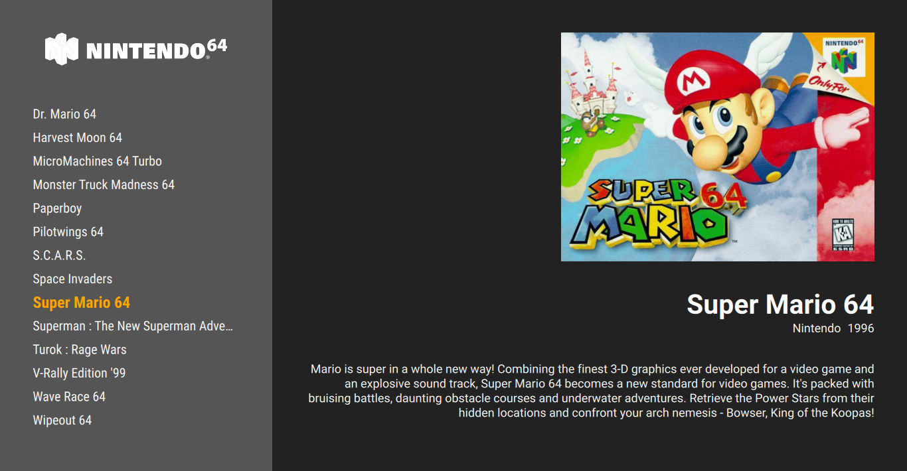

# Step by step: Simple theme

In this tutorial, I'll show the theme creation in practice by implementing the theme above from scratch. Before we start, you might want to be familiar with the QML basics and dynamic layout elements (see the [QML tutorials](qml-tutorials.md)).

The theme has the list of games on the left, in a scrollable menu, with the collection's logo above it. Then some basic information is shown on the right, like title, developer, release year, description, and also a box art.

Let's get started!

## Initial files

I'm on Linux, so my [theme directory](overview.md) is at `~/.config/pegasus-frontend/themes`. I'm creating a new directory called `tutorial-simple`, and in it my `theme.cfg`, like this:

```control
name: Simple theme
author: Mátyás Mustoha
```

and the basic `theme.qml`:

```qml
import QtQuick 2.0

FocusScope {

}
```

Now I open Pegasus and select this theme on the Settings screen. I'll keep Pegasus open during the development, and refresh the theme with the ++f5++ key after changes. I also open the main log file `~/.config/pegasus-frontend/lastrun.log` which will tell me if I've made any errors in the QML file.

!!! tip
    You can use whatever text editor you like. Qt Creator is cross platform, has good auto-complete and syntax highlight features. For a more lightweight editor, Sublime Text with the QML package, Atom or Notepad++ could be used, among others.

!!! note
    You might see `.qmlc` files popping up in your theme's directory. These are cache files, generated for faster loading. When copying the theme to a different machine, you don't have to bring them, they'll automatically get generated the next time you launch Pegasus.


## Base layout

The theme consists of a left and right main panel, so I'll start by adding them first. The left menu panel will take 1/3 of the whole screen, and have a lighter gray color. The right panel will be darker and take the rest of the screen.

```qml
import QtQuick 2.0

FocusScope {

    Rectangle {
        id: menu

        color: "#555"

        width: parent.width * 0.3
        anchors.top: parent.top
        anchors.bottom: parent.bottom
    }

    Rectangle {
        id: content

        color: "#222"

        anchors.left: menu.right
        anchors.right: parent.right
        anchors.top: parent.top
        anchors.bottom: parent.bottom
    }

}
```

!!! help
    Using anchors you can define the position and size of elements relative to each other; see [anchoring](qml-tutorials.md).

If you now refresh Pegasus, you'll now see that the screen has been divided between the two shades of gray. You can also see the width of the left panel changing automatically when you resize the application's window.


## Left panel

Lt's continue with the menu panel, as this will be the more complex part of the theme.

I'd like to add a 50px padding around the contents of the left panel. But the players have all kinds of screens and devices, with larger or smaller resolutions -- how can I define it in a resolution-independent way?

You can define values using percentages, like we did with the width earlier, but for cases where more precision is desired, the `vpx` function might be of use. These virtual pixel values will automatically scale up or down depending on the screen resolution: a `vpx(60)` value will turn into 60px on a 720p screen, 90 real pixels on 1080p and 40 on 480p, while keeping the aspect ratio. Combining them with anchors and regular percentages, you can define and position elements in a quite detailed way.

So, I want to add a 50px padding for the items -- and by this, I mean a padding that will be 50px on a screen with 1280x720 resolution, and scale up or down for other sizes. For later use, I'll store the amount of the remaining "content width" in a property:

```qml hl_lines="4"
Rectangle {
    id: menu

    property real contentWidth: width - vpx(100)

    color: "#555"

    width: parent.width * 0.3
    anchors.top: parent.top
    anchors.bottom: parent.bottom
}
```

### Collection logo

Lets's add the collection's logo to the panel. First of all you'll need a bunch of game system logo images. I've borrowed them from EmulationStation (original: Nils Bonenberger, CC-BY-NC-SA), except the RetroPie logo (original: Florian Müller, CC-BY-NC-SA). You can get them [here](https://github.com/mmatyas/pegasus-frontend/releases/download/alpha1/logos.zip). The file names match the system names from EmulationStation. Simply create a new directory inside your theme's folder, eg. `assets`, and extract them there.

After that, I add an Image element inside the `menu` Rectangle:

```qml
Rectangle {
    id: menu

    property real contentWidth: width - vpx(100)

    color: "#555"

    width: parent.width * 0.3
    anchors.top: parent.top
    anchors.bottom: parent.bottom

    Image {
        id: collectionLogo

        width: parent.contentWidth
        height: vpx(60)

        fillMode: Image.PreserveAspectFit
        source: "assets/" + api.currentCollection.shortname + ".svg"
        asynchronous: true

        anchors.horizontalCenter: parent.horizontalCenter
        anchors.top: parent.top
        anchors.topMargin: vpx(50)
    }
}
```

Some interesting things here:

- `api` is a globally accessible object through which you can access every game and collection data. Its contents are described on the [API reference](api.md) page.
- `source` is the concatenation of three strings, `shortname` being the short name for a collection (eg. `nes`, `gba`, ...).
- `asynchronous` will load the image in the background. By default (`false`), the program will wait until the Image is fully loaded, but during this time it cannot respond to user input. Since images may take a long time to load depending on the device, asynchronous loading is preferred in most cases.

### Changing collections

Pressing left or right feels kind of natural to use for selecting the next/previous collection. The CollectionList item of the API provides the functions called `incrementIndex()` and `decrementIndex()`, which we call for this.

I'll handle of the ++left++ and ++right++ keys the top of the whole FocusScope, and simply call these two functions:

```qml hl_lines="5 6"
import QtQuick 2.0

FocusScope {

    Keys.onLeftPressed: api.collectionList.decrementIndex()
    Keys.onRightPressed: api.collectionList.incrementIndex()


    Rectangle {
        // ...
    }

    Rectangle {
        // ...
    }
}
```

After a refresh, pressing ++left++ and ++right++ should now change the logo on the screen. Yay!

!!! note
    Assuming you have more than one collection, of course.

!!! tip
    Handling keyboard keys also enables gamepad navigation. See the [controls](../user-guide/controls) page about how keys and buttons are related.

### Game list

This is going to be actually the most complex piece of the theme. The games for the currently selected collection can be accessed via `api.currentCollection.gameList`, with `gameList.model` being the list of games, `gameList.current` the currently selected game (also available as `api.currentGame`) and `gameList.index` the index of the selected element. The index can be set manually to a number, or changed by the increment/decrement functions, similarly to the collections.

Returning to the `menu` Rectangle, I add a ListView after the logo, first setting just the dimensions:

```qml
Rectangle {
    id: menu

    // ...

    Image { /* ... */ }


    ListView {
        id: gameView

        width: parent.contentWidth
        anchors.horizontalCenter: parent.horizontalCenter
        anchors.top: collectionLogo.bottom
        anchors.bottom: parent.bottom
        anchors.margins: vpx(50)
    }
}
```

Now to actually see something, ListView needs a Model: a list of items, and a Delegate: the definition of how one item should look like on the screen.

Our model will be the games of the currently selected collection, and for every game, the visual representation will be a text item:

```qml
ListView {
    id: gameView

    model: api.currentCollection.gameList.model
    delegate: Text {
        text: modelData.title
    }

    // anchors, etc.
}
```

You should now see the list of games, changing with the selected collection on pressing ++left++/++right++.

!!! note
    `gameList.model` is a list of Game objects. `modelData` in the delegate will be one Game object of the Model.

I'll do two quick reorganization in the code:

- typing `api.currentCollection.gameList.<something>` every time is a bit long, so I create a property as a shortcut
- I move the Delegate definition to a separate object to make the code cleaner

```qml hl_lines="12 15 25"
Rectangle {
    id: menu

    // ...

    Image { /* ... */ }


    ListView {
        id: gameView

        property var gameList: api.currentCollection.gameList

        model: gameList.model
        delegate: gameViewDelegate

        width: parent.contentWidth
        anchors.horizontalCenter: parent.horizontalCenter
        anchors.top: collectionLogo.bottom
        anchors.bottom: parent.bottom
        anchors.margins: vpx(50)
    }

    Component {
        id: gameViewDelegate

        Text {
            text: modelData.title
        }
    }
}
```

!!! tip
    Component is a special element that defines a QML document. Just as QML files can have only one root element, Components can have only one child. You could actually move the `Text` to a separate file (eg. `GameListItem.qml`) and use the file's name to set the delegate (eg. `delegate: GameListItem { }`).

Let's continue with tweaking the menu items:

```qml
Component {
    id: gameViewDelegate

    Text {
        text: modelData.title

        // white, 20px, condensed font
        color: "white"
        font.family: globalFonts.condensed
        font.pixelSize: vpx(20)

        // the size of the whole text box,
        // a bit taller than the text size for a nice padding
        width: ListView.view.width
        height: vpx(36)
        // align the text vertically in the middle of the text area
        verticalAlignment: Text.AlignVCenter
        // if the text is too long, end it with ellipsis (three dots)
        elide: Text.ElideRight
    }
}
```

This is how it should look like:


To see which one of the menu items is the selected one, I'll change its color and make it bigger and bold:

```qml hl_lines="8 11 13"
Component {
    id: gameViewDelegate

    Text {
        text: modelData.title

        // orange if this item is the currently selected one, white otherwise
        color: ListView.isCurrentItem ? "orange" : "white"
        font.family: globalFonts.condensed
        // bigger if selected
        font.pixelSize: ListView.isCurrentItem ? vpx(24) : vpx(20)
        // bold if selected (hint: isCurrentItem is already a true/false value)
        font.bold: ListView.isCurrentItem

        width: ListView.view.width
        height: vpx(36)
        verticalAlignment: Text.AlignVCenter
        elide: Text.ElideRight
    }
}
```

!!! help
    When setting values, the `X ? A : B` form is called "inline-if": if the condition `X` is true, `A` will be used, otherwise `B`. In our case, it would equal to the following JavaScript code:

        :::js
        if (ListView.isCurrentItem)
            return "orange"
        else
            return "white"

    (which you can also use, if you wish).

### Game selection

You should now see one item being highlighted on the list. Now, to make the game selection work, we have to do two thing:

- make the ListView's index track the current game list's index
- change the game list index on pressing ++up++ or ++down++

To update the list when the index in the API changes, bind `gameList.index` to the ListView's `currentIndex`:

```qml hl_lines="8"
ListView {
    id: gameView

    property var gameList: api.currentCollection.gameList

    model: gameList.model
    delegate: gameViewDelegate
    currentItem: gameList.index

    width: parent.contentWidth
    anchors.horizontalCenter: parent.horizontalCenter
    anchors.top: collectionLogo.bottom
    anchors.bottom: parent.bottom
    anchors.margins: vpx(50)
}
```

While for the user input, call the index increment/decrement function of the current game list, like we did with the collection changing. At the top of our file:

```qml hl_lines="7 8"
import QtQuick 2.0

FocusScope {

    Keys.onLeftPressed: api.collectionList.decrementIndex()
    Keys.onRightPressed: api.collectionList.incrementIndex()
    Keys.onUpPressed: api.currentCollection.gameList.decrementIndexNoWrap()
    Keys.onDownPressed: api.currentCollection.gameList.incrementIndexNoWrap()


    Rectangle {
        // ...
    }

    Rectangle {
        // ...
    }
}
```

!!! tip
    There's a wrapping and a non-wrapping variant of the index changing functions. Use whichever is maching for your themes.

!!! note
    Of course, you can put the key handling somewhere else, I've merely found it convenient there. Just make sure the item in which you put it has the active focus (eg. has `focus: true`).

The list should now scroll around with a visible highlight for the current selection.

### Launching games

The last feature required to make our theme functional is launching games. Game objects from the API have a `launch()` command you can call -- in the most common case, all you need to do is calling `api.currentGame.launch()`.

Simply call it on ++enter++:

```qml hl_lines="9"
import QtQuick 2.0

FocusScope {

    Keys.onLeftPressed: api.collectionList.decrementIndex()
    Keys.onRightPressed: api.collectionList.incrementIndex()
    Keys.onUpPressed: api.currentCollection.gameList.decrementIndexNoWrap()
    Keys.onDownPressed: api.currentCollection.gameList.incrementIndexNoWrap()
    Keys.onReturnPressed: api.currentGame.launch()


    Rectangle {
        // ...
    }

    Rectangle {
        // ...
    }
}
```

!!! help
    Technically the ++enter++ next to the letter keys is called "Return", and the one on the numeric pad is "Enter". Careful not to mix them up.

And with this, we have a functional theme!

### Tweaks

Some additional (and optional) graphical tweaks to try out for extra fancyness.

#### Clipping

While scrolling, you might have noticed that items at the top and the bottom of the list seem to go out of the bounds of the ListView's area. Delegates are fully drawn on the screen if they are at least partially visible; to make sure nothing shows up outside the ListView's area, you can use the `clip` property:

```qml hl_lines="16"
ListView {
    id: gameView

    property var gameList: api.currentCollection.gameList

    model: gameList.model
    delegate: gameViewDelegate
    currentItem: gameList.index

    width: parent.contentWidth
    anchors.horizontalCenter: parent.horizontalCenter
    anchors.top: collectionLogo.bottom
    anchors.bottom: parent.bottom
    anchors.margins: vpx(50)

    clip: true
}
```

Now the ListView will cut the drawing at its borders.

#### Centering the current item

It'd be nice if the currently selected item would try to stay in the middle of the list:

<video autoplay loop style="max-width:100%;display:block;margin:0 auto"><source src="../webm/simple_hlrange.webm" type="video/webm"></video>

We can set this by defining the "highlight range"; the ListView will then try to scroll the list so the currently selected item falls into this range.

The highlight range is defined by the start and end position. For our vertical ListView, these are the distances from the top edge of the item, in pixels. We can get the vertical center of the ListView simply as `height / 2`, and the height of one Text item was set to 36px previously. To position it exactly in the middle, I'll set the start of the range 18px above the center, and end it 18px below.

```qml hl_lines="10 11 12"
ListView {
    id: gameView

    property var gameList: api.currentCollection.gameList

    model: gameList.model
    delegate: gameViewDelegate
    currentItem: gameList.index

    highlightRangeMode: ListView.ApplyRange
    preferredHighlightBegin: height * 0.5 - vpx(18)
    preferredHighlightEnd: height * 0.5 + vpx(18)

    width: parent.contentWidth
    anchors.horizontalCenter: parent.horizontalCenter
    anchors.top: collectionLogo.bottom
    anchors.bottom: parent.bottom
    anchors.margins: vpx(50)

    clip: true
}
```

which should give the desired result.

However, when you change the collection, there is a few seconds of scrolling to the index of the newly selected game list. To disable this, and jump to the selected item instantly, set animation duration to zero:

```qml hl_lines="11"
ListView {
    id: gameView

    property var gameList: api.currentCollection.gameList

    model: gameList.model
    delegate: gameViewDelegate
    currentItem: gameList.index

    highlightRangeMode: ListView.ApplyRange
    highlightMoveDuration: 0
    preferredHighlightBegin: height * 0.5 - vpx(18)
    preferredHighlightEnd: height * 0.5 + vpx(18)

    width: parent.contentWidth
    anchors.horizontalCenter: parent.horizontalCenter
    anchors.top: collectionLogo.bottom
    anchors.bottom: parent.bottom
    anchors.margins: vpx(50)

    clip: true
}
```

## Game information

With the game selection menu done, let's continue with the right side of the theme, the game informations. Metadata and assets of the currently selected game will be shown here; unlike the dynamic menu, these will be simple Text and Image objects, with their content coming from the API. We'll show the following information, in order:

- box art
- game title
- developer and release year (in one row)
- game description


### Box art

Add an Image object to the right side panel, with its source set to the current game's box art asset. The image will take the upper half of the screen, with a 50px padding around. As the box arts of different games may have different shapes (portrait, landscape, extra wide, etc.), it might be useful to define the maximum area an image may take up, and fit them in this area.

```qml
Rectangle {
    id: content

    color: "#222"

    anchors.left: menu.right
    anchors.right: parent.right
    anchors.top: parent.top
    anchors.bottom: parent.bottom


    Image {
        id: cover

        anchors.top: parent.top
        anchors.right: parent.right
        anchors.left: parent.left
        anchors.margins: vpx(50)
        anchors.bottom: parent.verticalCenter
        anchors.bottomMargin: 0

        fillMode: Image.PreserveAspectFit
        horizontalAlignment: Image.AlignRight

        source: api.currentGame.assets.boxFront
        sourceSize { width: 1024; height: 1024 }
        asynchronous: true
    }
}
```

Box art images might be quite big in resolution, so this time I've also set `sourceSize`: it limits the maximum amount of memory the image will take up. If the image is largen than this, it will be scaled down, keeping the aspect ratio. In this particular case, I've set it to scale down to 1024 &times; 1024 pixels (taking up about/at most 1024 &times; 1024 &times; 3 bytes = 3 MiB space in the memory).

!!! note "Column and Row"
    The QML Column and Row object are great tools for aligning a fixed number of elements. In this case, the box art and the further Text items could be put into a Column that would `anchors.fill` its parent with a 50px `anchors.margin`, so I wouldn't have to define it for the Image itself and the other Texts.

    So why I didn't use it? Column and Row works the best when the spacing between the elements is the same, but in this theme, I'd like to set some custom spacing between the elements later.

    An alternative would be to put the elements into an Item. Perhaps you might want to try it as a practice?

### Title

The rest of the game informations will be simple Text objects. The only thing that needs more attention is that the texts may be too long to fit on the screen, so we'll define a text area (similarly to the box art), and hide what doesn't fit into them.

So, for the title:

```qml
Rectangle {
    id: content

    // ...

    Image { /* ... */ }


    Text {
        id: title

        text: api.currentGame.title
        // white, big bold sans-serif font
        color: "white"
        font.family: globalFonts.sans
        font.pixelSize: vpx(42)
        font.bold: true

        horizontalAlignment: Text.AlignRight
        // if it's too long, end it with an ellipsis
        elide: Text.ElideRight

        // 40px below the box art
        anchors.top: cover.bottom
        anchors.topMargin: vpx(40)
        // left and right edges same as the image
        anchors.left: cover.left
        anchors.right: cover.right
    }
}
```

### Developer and release

I'll put two Text items in a Row, and move the Row under the title. I didn't bother wth a maximum text width here, as company names tend to be not too long, while the release year should be just four numbers.

The code:

```qml
Rectangle {
    id: content

    // ...

    Row {
        id: shortInfo

        anchors.top: title.bottom
        anchors.right: title.right

        spacing: vpx(10)


        Text {
            text: api.currentGame.developer
            color: "white"
            font.pixelSize: vpx(18)
            font.family: globalFonts.sans
        }

        Text {
            text: api.currentGame.year
            color: "white"
            font.pixelSize: vpx(18)
            font.family: globalFonts.sans
            visible: api.currentGame.year > 0 // !!
        }
    }

}
```

Note that I only show the year when it's greater than 0. If we have no information about when the game was released, `<Game>.year` will be 0, which looks silly on the screen.

### Description

A multiline text area. If the game has a short summar, it'll show that, otherwise the detailed description (or stay empty if none is available).

```qml
Rectangle {
    id: content

    // ...

    Text {
        id: description

        text: api.currentGame.summary || api.currentGame.description
        color: "white"
        font.pixelSize: vpx(18)
        font.family: globalFonts.sans

        wrapMode: Text.WordWrap
        horizontalAlignment: Text.AlignRight
        elide: Text.ElideRight

        anchors.top: shortInfo.bottom
        anchors.topMargin: vpx(40)
        anchors.bottom: parent.bottom
        anchors.bottomMargin: vpx(50)
        anchors.left: cover.left
        anchors.right: cover.right
    }
}
```

## Conclusion

With all these changes, our theme is now complete and should look like this:


Sure, perhaps not the most attractive yet, but I hope it helped learning theme creation. Feel free to tweak it to you liking, or make a new one based on it. Have fun!

??? note "Full code"
    Here is the full code, as one file. In real projects though, you might prefer to split your theme into multiple files.

        #!qml
        import QtQuick 2.0

        FocusScope {

            Keys.onLeftPressed: api.collectionList.decrementIndex()
            Keys.onRightPressed: api.collectionList.incrementIndex()
            Keys.onUpPressed: api.currentCollection.gameList.decrementIndexNoWrap()
            Keys.onDownPressed: api.currentCollection.gameList.incrementIndexNoWrap()
            Keys.onReturnPressed: api.currentGame.launch()

            Rectangle {
                id: menu

                property real contentWidth: width - vpx(100)

                color: "#555"

                width: parent.width * 0.3
                anchors.top: parent.top
                anchors.bottom: parent.bottom

                Image {
                    id: collectionLogo

                    width: parent.contentWidth
                    height: vpx(60)

                    fillMode: Image.PreserveAspectFit
                    source: "assets/" + api.currentCollection.shortname + ".svg"
                    asynchronous: true

                    anchors.horizontalCenter: parent.horizontalCenter
                    anchors.top: parent.top
                    anchors.topMargin: vpx(50)
                }

                ListView {
                    id: gameView

                    property var gameList: api.currentCollection.gameList

                    model: gameList.model
                    delegate: gameViewDelegate
                    currentIndex: gameList.index

                    highlightRangeMode: ListView.ApplyRange
                    highlightMoveDuration: 0
                    preferredHighlightBegin: height * 0.5 - vpx(18)
                    preferredHighlightEnd: height * 0.5 + vpx(18)

                    width: parent.contentWidth
                    anchors.horizontalCenter: parent.horizontalCenter
                    anchors.top: collectionLogo.bottom
                    anchors.bottom: parent.bottom
                    anchors.margins: vpx(50)

                    clip: true
                }

                Component {
                    id: gameViewDelegate

                    Text {
                        text: modelData.title

                        color: ListView.isCurrentItem ? "orange" : "white"
                        font.family: globalFonts.condensed
                        font.pixelSize: ListView.isCurrentItem ? vpx(24) : vpx(20)
                        font.bold: ListView.isCurrentItem

                        width: ListView.view.width
                        height: vpx(36)
                        verticalAlignment: Text.AlignVCenter
                        elide: Text.ElideRight
                    }
                }
            }

            Rectangle {
                id: content

                color: "#222"

                anchors.left: menu.right
                anchors.right: parent.right
                anchors.top: parent.top
                anchors.bottom: parent.bottom


                Image {
                    id: cover

                    anchors.top: parent.top
                    anchors.right: parent.right
                    anchors.left: parent.left
                    anchors.margins: vpx(50)
                    anchors.bottom: parent.verticalCenter
                    anchors.bottomMargin: 0

                    fillMode: Image.PreserveAspectFit
                    horizontalAlignment: Image.AlignRight

                    source: api.currentGame.assets.boxFront
                    sourceSize { width: 1024; height: 1024 }
                    asynchronous: true
                }

                Text {
                    id: title

                    text: api.currentGame.title
                    color: "white"
                    font.family: globalFonts.sans
                    font.pixelSize: vpx(42)
                    font.bold: true

                    horizontalAlignment: Text.AlignRight
                    elide: Text.ElideRight

                    anchors.top: cover.bottom
                    anchors.topMargin: vpx(40)
                    anchors.left: cover.left
                    anchors.right: cover.right
                }

                Row {
                    id: shortInfo

                    anchors.top: title.bottom
                    anchors.right: title.right

                    spacing: vpx(10)


                    Text {
                        text: api.currentGame.developer
                        color: "white"
                        font.pixelSize: vpx(18)
                        font.family: globalFonts.sans
                    }

                    Text {
                        text: api.currentGame.year
                        color: "white"
                        font.pixelSize: vpx(18)
                        font.family: globalFonts.sans
                        visible: api.currentGame.year > 0
                    }
                }

                Text {
                    id: description

                    text: api.currentGame.summary || api.currentGame.description
                    color: "white"
                    font.pixelSize: vpx(18)
                    font.family: globalFonts.sans

                    wrapMode: Text.WordWrap
                    horizontalAlignment: Text.AlignRight
                    elide: Text.ElideRight

                    anchors.top: shortInfo.bottom
                    anchors.topMargin: vpx(40)
                    anchors.bottom: parent.bottom
                    anchors.bottomMargin: vpx(50)
                    anchors.left: cover.left
                    anchors.right: cover.right
                }
            }
        }
