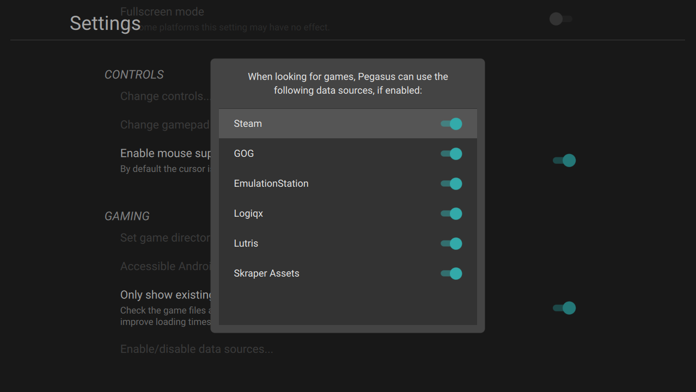

# How to add games

Games can come from two main sources: by listing it in a so-called metadata file, or by automatic detection from a third-party source (eg. Steam, GOG games).


## A) Automatic detection

Pegasus has built-in support for several game sources, depending on the particular platform. You can turn these on or off from the _Settings_ menu, under _Enable/disable data sources_.



The automatic detection requires no configuration. However, it also does not provide a way to ignore or edit games one-by-one – it uses whatever the third-party source provides, and only that. If this turns out to be an issue, you can always extend or replace them with custom metadata files, as described below.

[For more information about the third-party sources, see this page.](meta-sources.md)


## B) Metadata files

Metadata files are human readable, simple text files, describing game informations and their groupings. It looks like this:

```make
collection: Game Boy Advanced
launch: C:\GameBoy\myemulator.exe {file.path}


game: Advance Wars
file: Advance Wars (USA).gba
developer: Intelligent Games
genre: Strategy
players: 4
description:
   This turn-based strategy game hails back to a classic Japanese
   strategy game titled Famicom Wars. Advance Wars pits players against very
   computer AI in a number of battles involving submarines, warships, infantry,
   tanks, helicopters, and other weapons.
rating: 80%
```

A metadata file usually starts with a `collection` entry, for example a gaming platform, or any other grouping. There are no predefined names, you can use whatever you prefer. In this case, the collection also defines a default launch command for all the games in it.

A `game` entry describes the properties of a game. At the very least, it should have a _file_: this is what Pegasus will look for and launch. There can be more than one, eg. for games with multiple disks; in this case Pegasus will ask you which one to launch. If you look at the `launch` line of the `collection`, you can see `{file.path}`: this is a placeholder that will be replaced with the selected game file when you launch it.

Metadata files are called `metadata.pegasus.txt`, and are usually placed next to your games. You can the add them from the _Settings_ menu, _Game directories_. [Metadata files are documented in more detail here.](meta-files.md)
