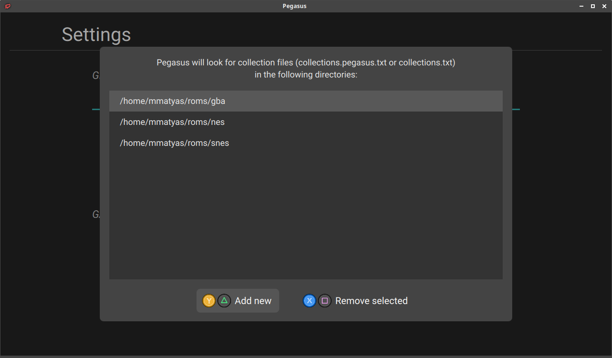

# Game collections and metadata files

To tell Pegasus in which directories it should look for games, you can use the *Settings menu* -> *Set game directories...* option.



In each of these directories, Pegasus will look for a *collection* and a *metadata* file:

- The **collection** file (`collections.pegasus.txt` or `collections.txt`) defines which files in the directory (and its subdirectories) should be treated as games, and thus appear in Pegasus. It also stores information about how to launch them (eg. open in emulator X, or run with parameter Y). All games are grouped into collections, but one game can belong to as many collections as you wish.

- The **metadata** file (`metadata.pegasus.txt` or `metadata.txt`) stores additional information about the individual games, such as title, developer(s) or release date. If a game need a special way to get launched, it can also be set here.

Pegasus will look for the files with `.pegasus.txt` extension first, and if they don't exist, will try the simple `.txt` variants.

!!! tip "EmulationStation"
    If you have EmulationStation installed and set up, Pegasus will also check the directories set in `es_systems.cfg`, read the `gamelist.xml` files and use the metadata and assets defined there.

    A tool for converting between ES and Pegasus files can be found [HERE](http://pegasus-frontend.org/tools/convert). Compared to ES files, the collection file is like `es_systems.cfg`, except it's local to the directory it's placed in, while the metadata file is mostly equal to `gamelist.xml`.

!!! tip "Steam"
    Pegasus is also compatible with Steam. No additional settings are necessary, installed Steam games will automatically appear in Pegasus with metadata and multimedia assets.


## File names

Pegasus looks for `collections.txt` or `collections.pegasus.txt` for the collection definitions, while metadata can be defined in `metadata.txt` or `metadata.pegasus.txt` (with these exact names). Pegasus will first check for the `.pegasus.txt` variant (in case you wish to store something else in the one with shorter name).

You can find examples for both files below, after their format and keywords are detailed.


## Common file format

Both configuration files have the same basic format; they store `key: value` pairs:

```make
collection: My Games
extensions: bin
ignore-file: buggygame.bin
ignore-file: duplicategame.bin
launch: myemulator {file.path}
```

```make
file: Advance Wars (USA).gba
title: Advance Wars
developer: Intelligent Games
genre: Strategy
players: 4
description: This turn-based strategy game hails back to a classic Japanese
    strategy game titled Famicom Wars. Advance Wars pits players against very
    computer AI in a number of battles involving submarines, warships, infantry,
    tanks, helicopters, and other weapons.
rating: 80%
x-id: 3782
x-source: ScreenScraper
```

- Keys are case insensitive, ie. `title`, `Title` and `TitLe` are the same. Keys always start an the beginning of the line and end at the first `:` (not including trailing spaces).
- Values are either single line or span multiple lines. Lines starting with space (or other whitespace characters) will be appended to the item's value (without leading or trailing whitespace), with a single space between the contents of the individual lines. Empty lines will be appended as line breaks.
- Both the keys and the values can contain Unicode characters.
- Lines starting with `#` are comments and will be ignored.


## Collection properties

The following keys can be used in the collection config files:

Key | Description
----|---
`collection` | Creates a new collection with the value as name (if it was not created yet). The properties after this line will modify this colection. This is a **required** field.
`launch` | A common launch command for the games in this collection. See below for the supported variables.
`command` | Same as `launch`. Use whichever you prefer.
`shortname` | An optional short name for the collection, often an abbreviation (like MAME, NES, etc.). Should be lowercase.

The following fields control which files of the directory should be included in the collection:

Key | Description
----|---
`extension` | A comma-separated list of file extensions, without the `.` dot. All files with these extensions (including those in subdirectories) will be included. This field can appear multiple times.
`file` | A single file to add to the collection. This field can appear multiple times.
`regex` | A Perl-compatible regular expression string, without leading or trailing slashes. Relative file paths matching it will be included. Unicode is supported.

The fields above with the `ignore-` prefix control which files should be excluded:

Key | Description
----|---
`ignore-extension` | Similarly to `extension` above.
`ignore-file` | Similarly to `file` above.
`ignore-regex` | Similarly to `regex` above.

**Exclusion is stronger than inclusion**: if both the normal and the `ignore-` fields match for a file, it will be excluded.

Keys starting with `x-` can be used to extend the format with additional data. This could be used, for example, by other softwares (eg. scrapers) to store some program-specific data.

!!! tip "Plural forms"
    Sometimes writing the plural forms of the fields feels more natural, so `extensions`, `files`, `ignore-extensions` and `ignore-files` are also supported, without any difference to their regular forms.

!!! tip "Multiple directories"
    Collections can span over multiple directories if they have the same name. This means you can create categories such as "Platformer games", for which the game files themselves might be located in different directories.


### Launch command parameters

The following variables will be replaced in the launch command value:

Variable | Description | Example
---------|-------------|---------
`{file.path}` | Absolute path to the file. | `/home/joe/games/mygame.bin`
`{file.name}` | The file name part of the path | `mygame.bin`
`{file.basename}` | The file name without extension (ie. until but not including the last dot) | `mygame`
`{file.dir}` | The directory where the file is located. | `/home/joe/games`

Note that the variables will be replaced as-is, without additional formatting. You might need to eg. wrap them in quotes.

### Example

Let's say you have Super Nintendo games under `C:/games/snes`. Then you'd create `C:/games/snes/collections.txt` with the following contents:

```make
# Selects all files with the provided extension, except two games
collection: Super Nintendo Entertainment System
shortname: snes
extensions: 7z, bin, smc, sfc, fig, swc, mgd, zip, bin
ignore-file: buggygame.bin
ignore-file: duplicategame.bin
launch: myemulator "{file.path}"

# A collection of 3 games. They're also part of 'My Games'.
collection: Platformer games
files: mario1.bin
files: mario2.bin
files: mario3.bin

# A regex example; includes games with '[number]-in-1' in their name.
collection: Multi-game carts
regex: \d+.in.1
```

Then add `C:/games/snes` to `[config directory]/game_dirs.txt` in a new line. The games and categories will appear the next time you start Pegasus.


## Metadata properties

The following properties can be used in the metadata files:

Key | Description
----|---
`file` | Relative path to the file for which the metadata after this line will be added. If the file is not included in any collection, all properties will be ignored until the next `file` key. This is a **required** field.
`title` | The proper title of the game. If it's not defined, the file name without extension will be used.
`name` | Same as `title`. Use whichever you prefer.
`developer` | The developer or the game. This field can appear multiple times.
`publisher` | The publisher or the game. This field can appear multiple times.
`genre` | A comma-separated list of genres. This field can appear multiple times.
`summary` | A short description of the game in one paragraph.
`description` | A possibly longer description of the game.
`players` | The number of players who can play the game. Either a single number (eg. `2`) or a number range (eg. `1-4`).
`release` | The date when the game was released, in YYYY-MM-DD format (eg. `1985-05-22`). Month and day can be omitted if unknown (eg. `1985-05` or `1985` alone is also accepted).
`rating` | The rating of the game, in percentages. Either an integer percentage in the 0-100% range (eg. `70%`), or a fractional value between 0 and 1 (eg. `0.7`).
`launch` | If this game must be launched differently than the others in the same collection, a custom launch command can be defined for it.
`command` | Same as `launch`. Use whichever you prefer.

Like with the collections, keys starting with `x-` can be used to extend the format with additional data. This could be used, for example, by other softwares (eg. scrapers) to store some program-specific data.

!!! tip "Plural forms"
    As with the collections, plural forms for the keys with multiple values are also supported, so `developers`, `publishers` and `genres` will work too.

### Example

Continuing with the collection example, a file called `C:/games/snes/metadata.txt` could look like this:

```make
file: Alien Hominid (Europe) (En,Fr,De,Es,It).gba
title: Alien Hominid
developer: Zoo Digital
genre: Shooter
players: 1
summary: You're a little yellow alien.  The FBI has shot down your ship
  while flying over planet Earth.  And it, quite literally, lands right on their
  doorstep.  After a series of FBI Agents swipe your ship, what option do you have
  other than to blow up everything in your path to get it back?
description:
  Alien Hominid is a 2D side-scrolling shooter with heavy references to the Metal
  Slug series of games - from the hand-drawn graphics, huge explosions, right down
  to the ability to eviscerate FBI Agents when you get up close to them.  The
  graphics are by featured artist Dan Paladin.  Your goal, is quite simply, to get
  to the end of the stage, and die as little as possible.  Which is made difficult
  due to the fact that any bullet is an instant kill.

  To help you out, you can grab a range of power-ups, such as lasers, spread
  shots, shotguns and more, as well as hijacking vehicles and using them for
  protection.  Grenades can be lobbed, and you can jump on enemy shoulders and
  choose to bite their heads off if you like, or pick them up and throw them at
  other enemies.  You can also dive underground for a short period of time to
  avoid enemies - while underground, you can drag agents into the ground to kill
  them.
rating: 50%
x-id: 4149
x-source: ScreenScraper


file: Altered Beast - Guardian of the Realms (USA).gba
title: Altered Beast : Guardian of the Realms
developer: THQ
genre: Action
rating: 60%
x-id: 4139
x-source: ScreenScraper
```
