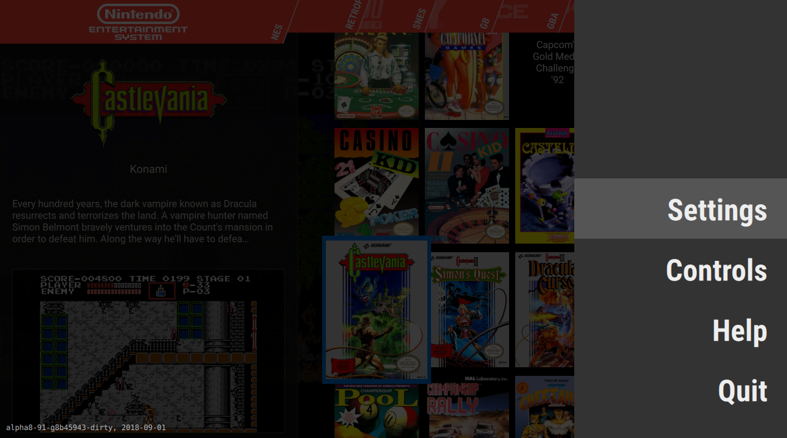

# <i class="fas fa-fire" style="color:#ff4136"></i> Getting started!

Welcome to the documentation of the Pegasus frontend! Here you can find information about how to install and configure Pegasus on your device, and further along, about the various customization possibilities. Let's get started!

## <i class="fas fa-download" style="color:#2ecc40"></i> Installation

Pegasus is available for various devices and operating systems. Currently there are official releases for the following platforms:

- **Windows** 7 or later
- **Linux** with Ubuntu 18.04/Debian Buster or later
- **Raspberry Pi** with Raspbian Buster or later
- **Odroid** C0/C1/C2 and XU3/XU4 with Ubuntu 18.04 or later
- **Android** 5 (Lollipop) or later
- **macOS** 10.13 (High Sierra) or later

For each platform, there are two main release channels:

- the **latest** version contains the latest fixes and improvements, but are not well tested before release
- the **stable** version is a release that's been out for a few weeks already, and our community found no unexpected issues with it so far

For more details, select your preferred platform:

??? help "Windows"
    1. (Recommended) Install a codec pack: Pegasus uses Windows' built-in media engine for playing video files, and some formats, for example Steam's trailers require codecs. If the codecs are not present, the videos may make Pegasus crash
    2. Download your preferred release from <a href="http://pegasus-frontend.org/" target="_blank">pegasus-frontend.org</a>, under the *Downloads* section
    3. Extract it somewhere
    4. (Optional) If you'd like to run Pegasus in portable mode (eg. you plan to place it on a USB drive), create a new file called `portable.txt` and place it next to Pegasus

??? help "Android"
    1. Enable installing APK files: in the Android Settings, under Security, turn on *Unknown Sources*. Pegasus is not available from the Play Store yet, and installing APK files have to be enabled manually like this
    2. Download your preferred release from <a href="http://pegasus-frontend.org/" target="_blank">pegasus-frontend.org</a>, under the *Downloads* section
    3. Open the APK file with any file manager app, and press "Install"
    4. The first time you open Pegasus, it will ask for permission to access the storage. Make sure to enable them so that Pegasus could see your games
    5. (Optional) Android will ask if you wish to use Pegasus as the default launcher. You can also change this from Android's Settings menu, see the [platform notes](../platform-android/#default-launcher) for more details

??? help "Linux - Desktop"
    **Using the Ubuntu/Debian package manager**

    1. Download the Debian package (`.deb`) of your preferred release from <a href="http://pegasus-frontend.org/" target="_blank">pegasus-frontend.org</a>, under the *Downloads* section
    2. Install it by double clicking on it (or manually from the command line)
    3. (Optional) Run the commands under the "APT repository" section to make sure the system keeps it up to date

    **Using the standalone package**

    1. Download the standalone version of your preferred release from <a href="http://pegasus-frontend.org/" target="_blank">pegasus-frontend.org</a>, under the *Downloads* section
    2. Extract it somewhere
    3. (Optional) If you'd like to run Pegasus in portable mode (eg. you plan to place it on a USB drive), create a new file called `portable.txt` and place it next to Pegasus
    4. Install the required dependencies -- see the [platform notes](platform-linux.md) for more details

    **Using Flatpak**

    - You can install the stable version from either a graphical software manager, or manually following the instructions at https://flathub.org/apps/details/org.pegasus_frontend.Pegasus

    **Using AUR**

    - A community maintained release is available from AUR, see the [platform notes](../platform-linux/#arch) for more details

??? help "Linux - Raspberry/Odroid"
    **Using the standalone package**

    1. Download your preferred release from <a href="http://pegasus-frontend.org/" target="_blank">pegasus-frontend.org</a>, under the *Downloads* section. Make sure you download it for the correct device -- they are, in most cases, not interchangeable
    2. Extract it somewhere
    3. (Optional) If you'd like to run Pegasus in portable mode (eg. you plan to place it on a USB drive), create a new file called `portable.txt` and place it next to Pegasus
    4. Install the required dependencies -- see the [platform notes](platform-linux.md) for more details

    **Using RetroPie**

    - You can find Pegasus under the *experimental* section -- see [this page](platform-retropie.md) for more details

??? help "macOS"
    1. Download your preferred release from <a href="http://pegasus-frontend.org/" target="_blank">pegasus-frontend.org</a>, under the *Downloads* section
    2. Extract it somewhere

!!! info "Other platforms"
    Pegasus can also run on platforms not listed above, but may need to be compiled manually from source code. If you wish to do that, the [Build documentation](../dev/build.md) can help you

## <i class="fas fa-mouse" style="color:#ff851b"></i> Basic navigation

The first time you start Pegasus, you'll be either greeted with a message that says no games have been found, or depending on your system, there might be already games present from other sources (eg. Steam or EmulationStation).

In either way, you can reach the main menu by pressing the ESC key, the "back button" ( / ) on a gamepad, or by dragging out the menu panel from the right edge of the screen with your mouse or finger.

You can navigate in the menu (and in the whole program in general) using the arrow keys, the directional buttons, the left stick or your mouse and finger. You can select item by pressing the Enter key, the "select button" ( / ) or simply clicking/pressing on an item.

!!! info "Controls"
    For the full list of the default navigation keys and buttons, visit [the Controls page](controls.md).

## <i class="fas fa-tools" style="color:#17a2b8"></i> Configuration

On the Settings screen, you can set some general parameters, like the language of the interface or whether you'd like to run in full screen or windowed mode. You can also change the "theme", the look and feel of the whole program.

Pegasus is a program that can collect your list of games from various sources. You can import your list of games from other, already installed game libraries, like Steam, for which there is built-in support. For others, especially emulators and standalone games, you can use Pegasus' own *metadata* files, which is documented on [this page](meta-files.md).

The behaviour of the game searching can be configured in the Gaming section:

- The **Set game directories** option will open a dialog where you can edit the list of directories Pegasus will search for *metadata* files (see the documentation linked above).
- On the **Enable/disable data sources** panel you can enable or disable importing games from the individual data sources that might be available on your system.

Outside the Settings menu, there's also the Controls screen, where you can configure your gamepad's layout, and a Help screen that shows some information about Pegasus, and contains a link to this documentation site.

## <i class="fas fa-fan" style="color:#b10dc9"></i> Customization

Now that you're done with the basics, you might want to dig deeper into the customization aspect of Pegasus. Here are a few articles you could take a look, if you're interested:

- [Metadata files](meta-files.md)
- [Asset files](meta-assets.md)
- [Scripting](scripting.md)
- [Creating themes](../themes/overview.md)

[>> Back to the index](../)
