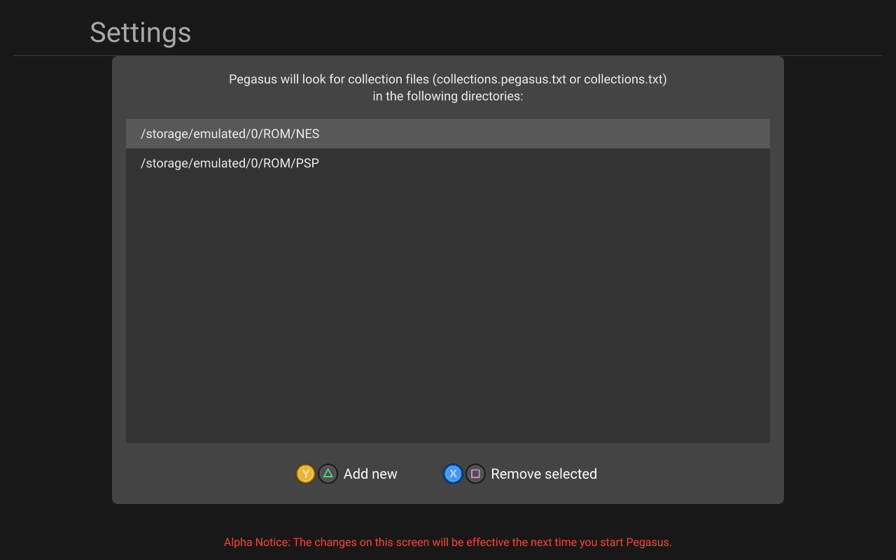

# Real-world examples

On this page, some real-world examples have been collected for the various supported platforms.

*(under construction)*

## Android

Let's say I want to play my NES and PSP games on Android. I'd like to use RetroArch with the `fceumm` core (installed from its menu) for emulating NES, and use the standalone PPSSPP app for PSP. After copying the roms to the SD card, my directory structure looks like this *(games are examples)*:

```
[SD card]
└─ Roms
   ├─ NES
   │  ├─ Contra.zip
   │  └─ Super Mario.zip
   └─ PSP
      ├─ Patapon.iso
      └─ Lumines.cso
```

I've also downloaded assets (like box art and video) for my games using a [scraper](meta-assets.md#how-to-get-assets-for-my-games). To make pegasus automatically find them, I place them in a directory called `media` for each system:

<pre>
[SD card]
└─ Roms
   ├─ NES
   │  ├─ <b>media</b>
   │  │  ├─ <b>Contra</b>
   │  │  │  ├─ <i>boxFront.png</i>
   │  │  │  └─ <i>video.mp4</i>
   │  │  └─ <b>Super Mario</b>
   │  │     ├─ <i>boxFront.png</i>
   │  │     └─ <i>video.mp4</i>
   │  ├─ Contra.zip
   │  └─ Super Mario.zip
   └─ PSP
      ├─ <b>media</b>
      │  ├─ <b>Patapon</b>
      │  │  └─ <i>boxFront.png</i>
      │  └─ <b>Lumines</b>
      │     ├─ <i>boxFront.png</i>
      │     └─ <i>video.mp4</i>
      ├─ Patapon.iso
      └─ Lumines.cso
</pre>

(see the documentation [here](meta-assets.md#the-media-directory))

Now I create a [collection file](meta-files.md) for each system. As mentioned in the [Android platform notes](platform-android.md), RetroArch happens to need a bunch of parameters, but PPSSPP can just open the file directly. Here are my configs:

??? note "[SD card]/Roms/NES/collections.txt"
        :::make
        collection: NES
        extensions: zip
        launch: am start
          --user 0
          -n com.retroarch/.browser.retroactivity.RetroActivityFuture
          -e ROM "{file.path}"
          -e LIBRETRO /data/data/com.retroarch/cores/fceumm_libretro_android.so
          -e CONFIGFILE /storage/emulated/0/Android/data/com.retroarch/files/retroarch.cfg
          -e IME com.android.inputmethod.latin/.LatinIME
          -e DATADIR /data/data/com.retroarch
          -e APK /data/app/com.retroarch-1/base.apk
          -e SDCARD /storage/emulated/0
          -e DOWNLOADS /storage/emulated/0/Download
          -e SCREENSHOTS /storage/emulated/0/Pictures
          -e EXTERNAL /storage/emulated/0/Android/data/com.retroarch/files
          --activity-clear-top

??? note "[SD card]/Roms/PSP/collections.txt"
        :::make
        collection: PSP
        extension: iso, cso
        launch: am start
          --user 0
          -a android.intent.action.VIEW
          -d "file://{file.path}"

!!! warning "SD card path"
    In the above configurations I use `/storage/emulated/0/` which is the path of the SD card on my device. This might be different for you! You can check the path in most file manager apps, look for something like "file details" or similar.

While it's optional, I'd also like some descriptions and such for my games, so I create a [metadata file](meta-files.md) in the NES and PSP directories as well:

??? note "[SD card]/Roms/NES/metadata.txt"
        :::make
        file: Contra.zip
        title: Contra
        developer: Konami
        players: 2
        description: In the year 2633, the evil Red Falcon Organization have set a base on the Galuga
          archipelago near New Zealand in a plot to conquer the world. Two commandos, Pfc. Bill Rizer
          and Pfc. Lance Bean of the Contra unit (an elite group of soldiers specializing in guerrilla
          warfare), are sent to the island to destroy the enemy forces and uncover the true nature of
          Red Falcon, the alien entity controlling them.


        file: Super Mario.zip
        title: Super Mario Bros.
        developer: Nintendo
        players: 2
        description: In the fantasy setting of the Mushroom Kingdom, a tribe of turtle-like creatures
          known as the Koopa Troopas invade the kingdom and uses the magic of its king, Bowser, to
          turn its inhabitants, known as the Mushroom People, into inanimate objects such as bricks,
          stones and horsehair plants. Bowser and his army also kidnap Princess Toadstool, the princess
          of the Mushroom Kingdom and the only one with the ability to reverse Bowsers spell. After
          hearing the news, Mario sets out to save the princess and free the kingdom from Bowser.

??? note "[SD card]/Roms/PSP/metadata.txt"
        :::make
        file: Patapon.iso
        title: Patapon
        description: For years the Patapon tribe has lived in the desolate frontier, driven from their
          home by the evil Zigoton army. Behind the Patapons cute exterior, lies a fierce warrior
          spirit that can only be commanded by the beat of their God’s war drum. They wait for the day
          that the "Almighty" will return, to lead them against their enemies and bring them back to
          their homeland. Finally, their wait has come to an end as the drums of war are heard once
          again.


        file: Lumines.cso
        title: LUMINES
        description: LUMINES brings minimalism to the puzzle genre where the fusion of light and sound
          sets the stage for a two-color falling block experience in HD and 4K. Groove to electronic
          jams while strategically dropping blocks before the BPM bar sweeps combos clean after each
          measure.

After that, I open Pegasus, go to the Settings menu &rarr; Set game directories, and add both collection files to the list.



At the moment, Pegasus have to be restarted for the changes to take effect, so I quit using the menu. Then starting Pegasus again, the games should appear as expected.
